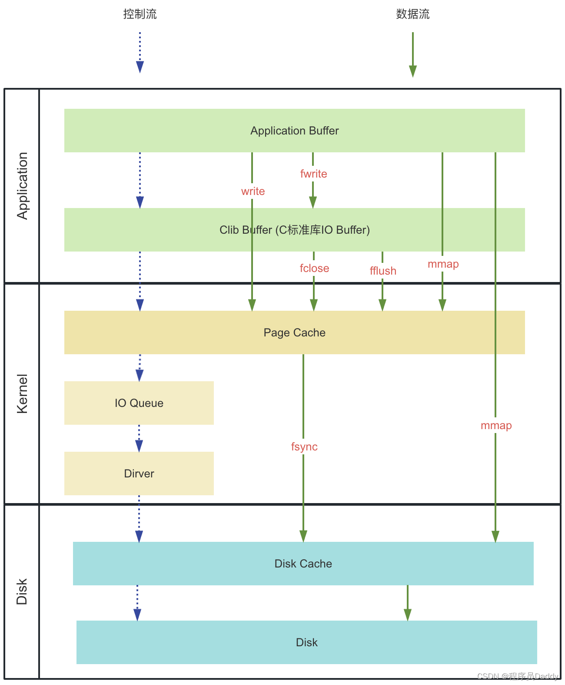
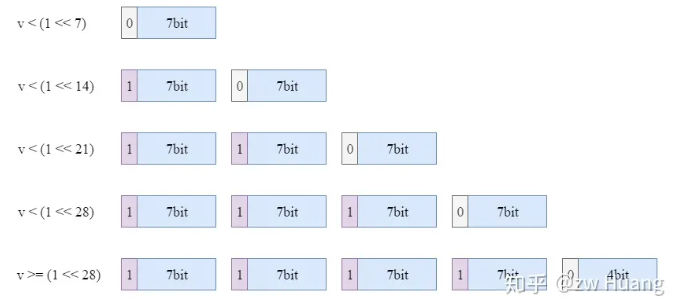
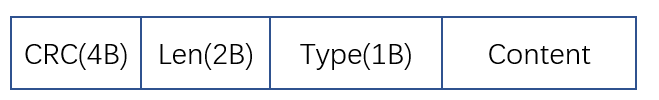
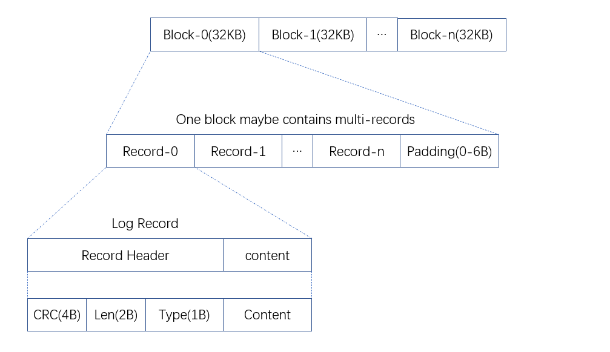
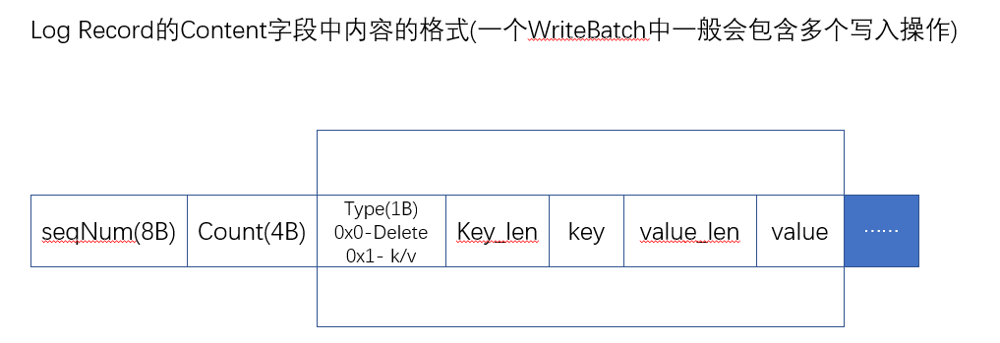
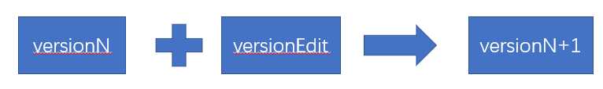

# LevelDB

LevelDB结构简单,不依赖于任何第三方库,具有很好的独立,虽然其有针对性的对BigTable做了一定程度的简化,然而BigTable的主要技术思想与数据结构都体现在了LevelDB中。因此,LevelDB可以看作是BigTable的简化版或单机版。

# 基本数据结构

## Slice

重点了解为什么使用Slice而不使用String。

## Comparator

Comparator本身是一个纯虚类（类似于Go中的Interface），可以以子类BytewiseComparatorImpl和InternalKeyComparator为例进行开始阅读，其中AdvanceFucntions部分可能刚开始不知道是做什么用的，后面读到LevelDB的一些功能后，就知道其适用场景了。

## Iterator

LevelDB的Iterator十分强大，同样Iterator本身是一个纯虚类，唯一的非虚函数是CleanUp函数，用于回收迭代器的资源，由Iterator的析构函数调用相关cleanup函数实现资源的释放与清除。

## 系统参数

详情请见头文件options.h中的内容。里面介绍了一些数据压缩方式，以及在使用DB::Open启动数据库实例时可以指定的一些参数。具体分为如下几类参数：

- 影响DB行为的参数。
- 影响DB性能的参数。

这里有一个和DB::Write操作相关的sync参数需要提一下，sync\==false的DB写操作具有与“write()”系统调用相似的崩溃语义。sync==true的DB写操作具有与“write()”系统调用后的“fsync()”相似的崩溃语义。

传统的UNIX实现在内核中设有缓冲区高速缓存或页面高速缓存，大多数磁盘I/O都通过缓冲进行。当将数据写入文件时，内核通常先将该数据复制到其中一个缓冲区中，如果该缓冲区尚未写满，则并不将其排入输出队列，而是等待其写满或者当内核需要重用该缓冲区以便存放其他磁盘块数据时，再将该缓冲排入输出队列，然后待其到达队首时，才进行实际的I/O操作。这种输出方式被称为延迟写（delayed write）（Bach [1986]第3章详细讨论了缓冲区高速缓存）。

延迟写减少了磁盘读写次数，但是却降低了文件内容的更新速度，使得欲写到文件中的数据在一段时间内并没有写到磁盘上。当系统发生故障时，这种延迟可能造成文件更新内容的丢失。为了保证磁盘上实际文件系统与缓冲区高速缓存中内容的一致性，UNIX系统提供了sync、fsync和fdatasync三个函数。

sync函数只是将所有修改过的块缓冲区排入写队列，然后就返回，它并不等待实际写磁盘操作结束。
通常称为update的系统守护进程会周期性地（一般每隔30秒）调用sync函数。这就保证了定期冲洗内核的块缓冲区。命令sync(1)也调用sync函数。

fsync函数只对由文件描述符filedes指定的单一文件起作用，并且等待写磁盘操作结束，然后返回。fsync可用于数据库这样的应用程序，这种应用程序需要确保将修改过的块立即写到磁盘上。
fdatasync函数类似于fsync，但它只影响文件的数据部分。而除数据外，fsync还会同步更新文件的属性。

对于提供事务支持的数据库，在事务提交时，都要确保事务日志（包含该事务所有的修改操作以及一个提交记录）完全写到硬盘上，才认定事务提交成功并返回给应用层。

# LevelDB简介

## 源码结构

与数据库实现相关的数据结构和相关文件目录主要有如下几种：

- `class LEVELDB_EXPORT DB`：主要包含了数据库的一些基本接口操作和内部实现。一个DB对象是一个持久化的有序map，它将key映射到value。DB对象可以安全地被多个线程并发访问，而不需要外部同步机制。
- `class LEVELDB_EXPORT Table`：Table是SSTable(Sorted String Table)的主要实现载体。Table是一个有序的字符串到字符串的映射。Table是**不可变的**和**持久化**的。Table可以安全地被多个线程并发访问，而不需要外部同步机制。
- helpers目录：定义了将LevelDB稳定存储中的数据的介质变为内存环境的方法。（即将底层存储由磁盘介质完全变成内存），主要用于相关的测试场景或某些全内存的运行场景。
- util目录：包含一些通用的基础类函数，如内存管理、布隆过滤器、编码、CRC等相关函数。
- include目录：包含了LevelDB的库函数，可供外部访问的接口、以及一些基本的数据结构等等。
- port目录：定义了一个通用的底层文件，以及相关的多个进程操作接口，还有基于OS平台可移植性理念实现的各个OS平台相关的具体接口。

## 性能优化方案

### 启用压缩

**LevelDB的数据文件由一系列的压缩块组成**，每个块中存放了key相邻的键值对。读写操作均以块为单位进行。用户可以通过DB::Open中的Options参数改变块大小。块大小有利有弊，根据用户场景决定。

### 启用Cache

cache可以充分利用内存空间，将常用数据存到cache中，减少访问频率。此外，在使用Iterator进行访问的时候，用户可以自行规定本次访问是否会替换cache的数据。**缓存数据是以块为单位的。**

### 启用filter policy

FilterPolicy主要用于尽可能的减少度过程中磁盘I/O的操作次数，后续会详细介绍。

### key的命名设计

LevelDB中的键值对按照key的顺序进行存储。我们可以将经常同时访问的数据加上相同的前缀，从而将这些数据放到同一个块中，冷门数据放到别的块中，从而减少I/O次数。

# LevelDB总体架构与设计思想

## 主要模块功能

LevelDB是一个开源的键值存储库，具有高性能和轻量级的特点。其总体模块架构包括接口API、Utility公用基础类和LSM树三个主要部分，如下所述：

**接口API**：

- **DB API**：提供对数据库的基本操作接口，包括插入、删除、查询等功能。
- **POSIX API**：提供了对底层文件系统的基本操作接口，例如文件读写、文件定位等，用于实现数据库的持久化。

**Utility公用基础类**：

- 这些基础类提供了LevelDB内部实现所需的公共功能，例如内存管理、文件操作、日志记录、布隆过滤器、CRC校验、哈希表等。

**LSM树**（Log-Structured Merge-Tree）：

- **LOG**：日志结构组件，用于记录数据库的变更操作，提供了高效的写入能力。顺序写更快。
- **MemTable**：内存表，是一个基于内存的数据结构，用于存储最新的键值对，提供了快速的写入性能。
- **SSTable**（Sorted String Table）：有序字符串表，是将内存表中的数据持久化到磁盘的数据结构，采用了基于排序的方式，使得查询操作更加高效。

整个架构的设计使得LevelDB具有良好的写入性能和查询性能，并且能够有效地处理大规模数据集。

## 主要操作流程(Open、Get、Put、Delete)

LevelDB提供了很多API接口，这里选择Open()、Get()、Put()、Write()三种主要类型进行介绍。db.h中定义的是相关接口定义，而db_impl.h中的db_impl类是DB的一个子类，实现了包含上述4种等等的一些DB API，因此我们以db_impl类中的API定义去学习。

- db_impl.h中有DB类的一些默认实现，当然也包括上述4种操作，除了open()操作只有DB类定义了，剩下的操作db_impl和DB类都有，我们以db_impl为主。

### Manifest文件

**Manifest文件**在LevelDB中扮演着关键的角色。让我来详细解释一下：

1. **元数据存储**：Manifest文件保存了整个LevelDB实例的元数据，其中包括了每一层中存在哪些SSTable（Sorted String Table）。

2. **格式和记录**：实际上，Manifest文件就是一个日志文件，其中的每个日志记录都是一个VersionEdit。VersionEdit用于表示一次元数据的变更，例如新增、删除SSTable等操作。Manifest文件保存了VersionEdit序列化后的数据。

3. **VersionEdit**：VersionEdit记录了数据库元数据的变更，包括以下信息：
   - `comparator_`：比较器的名称，在创建LevelDB时确定，之后不可更改。
   - `log_number_`：最小的有效日志编号，    小于该编号的日志文件可以删除。
   - `prev_log_number_`：已废弃，代码保留用于兼容旧版本的LevelDB。
   - `next_file_number_`：下一个文件的编号。
   - `last_sequence_`：SSTable中的最大序列号。
   - `compact_pointers_`：记录每一层要进行下一次compaction的起始键。
   - `deleted_files_`：可以删除的SSTable（按层级和文件编号）。
   - `new_files_`：新增的SSTable。

4. **Version和VersionSet**：
   - **Version**：是应用`VersionEdit`后得到的数据库状态，即当前版本。它包含了哪些SSTable，并通过引用计数确保多线程并发访问的安全性。读操作需要在读取SSTable之前调用`Version::Ref`增加引用计数，不再使用时需要调用`Version::UnRef`减少引用计数。
   - **VersionSet**：是一组`Version`的集合。随着数据库状态的变化，LevelDB会生成新的VersionEdit，从而产生新的Version。同一时刻可能存在多个Version，VersionSet通过链表维护这些Version。

## LevelDB的写：DBImpl::write()

当某个写操作在刷盘的时候，可以暂时释放锁，因为&w当前负责记录日志，并保护记录操作免受并发的loggers和并发写入memtable的影响。刷盘之前已经完成了对相关共享变量的更新，此时可以释放锁，允许新的请求进来。

## 快照（Get操作的前置条件）

当向Memtable或者Immutable Memtable、SSTable查找数据时，是构造了一个LookupKey对象，然后调用Get()方法进行查找的。Lookupkey = InternalKey + SequenceNumber。而sequenceNumber是来自Get()方法选项参数中的snapshot。

这就实现了多版本读取机制。

# 公用基础类

LevelDB自行实现的一些独立于OS的API，Mutex和Condvar很常见，就不细说了，AtomicPtr是一种可以实现无锁原子读写操作的数据类型。可以类比一下OS提供的无锁原语：TAS、CAS等等。当前LevelDB已经移除了这个类型。

## MemoryBarrier(如smp_mb())

内存屏障在多核CPU中是非常重要，因为在多核CPU中，不同核之间的数据是不共享的，所以需要通过屏障来保证数据的一致性。

有关内存屏障相关的文章，[内存屏障（Memory Barrier）究竟是个什么鬼？ - 知乎 (zhihu.com)](https://zhuanlan.zhihu.com/p/125737864)这篇讲的很好，可以看看细节。

> **smp_mb() 这个内存屏障的操作会在执行后续的store操作之前，首先flush store buffer（也就是将之前的值写入到cacheline中）。**

### 内存屏障例子：AtomicPtr的load和store

这里AtomicPointer中的带有内存屏障的load和store函数进行说明这么安排的原因：

```c++
void* AtomicPointer::Acquire_Load() const {
  void* result = rep_;
  MemoryBarrier(); // 内存屏障
  return result;
}

void AtomicPointer::Release_Store(void* v) {
  MemoryBarrier(); // 内存屏障
  rep_ = v;
}
```

`Acquire_Load` 函数：

- 在读取 `rep_` 的值之后立即执行内存屏障操作。
- 这个内存屏障确保在返回 `rep_` 的值之前，所有之前的读取操作都已经完成，保证了在使用 `rep_` 值时的一致性和正确性。

`Release_Store` 函数：

- 在将传入的指针 `v` 赋值给 `rep_` 之前立即执行内存屏障操作。
- 这个内存屏障确保在写入 `rep_` 之前，所有之前的写入操作对于后续的写入操作都是可见的，保证了其他线程能够看到这个写入操作，从而避免了数据不一致的情况。

### 内存屏障总结

内存屏障（Memory Barrier）是一种同步机制。

内存屏障的作用是确保在多线程环境下对共享数据的访问操作的顺序性和可见性。它会告诉编译器和CPU在某个点之前的所有内存访问操作都完成（对于读操作）或者对其他线程可见（对于写操作）。

内存屏障不会阻塞线程或者等待某些操作的完成，而是确保在某个时刻之前的所有内存访问操作都被执行或者对其他线程可见。这种机制是为了解决多线程并发访问共享数据时可能出现的问题，比如数据竞争、指令重排等。

所以，可以将内存屏障看作是一种同步点，它确保在这个点之前的所有内存操作都已经完成或者对其他线程可见，从而保证了程序的正确性。

## 文件操作



这里主要关注了LevelDB中使用mmap方法实现的随机读接口：`PosixMmapReadableFile`。mmap方法将文件映射到内存中，然后通过内存访问文件内容，相比于普通的文件读取，mmap()省去了内核空间到用户空间的数据拷贝，提高了文件读取的效率。

还有Posix下的顺序读、随机读的一些接口设计，他们本质上都是封装了Posix提供的读写接口。LevelDB的随机读取实现默认采用mmap的随机读接口。

注意几种写操作的不同，上图很形象的说明了这一点。具体可以看这篇文章[Linux I/O操作fsync后数据就安全了么(fsync、fwrite、fflush、mmap、write barriers详解)-CSDN博客](https://blog.csdn.net/hilaryfrank/article/details/112200420)

## Env对象

LevelDB 中的 Env 对象是一个环境抽象层，用于提供操作系统相关的功能，如文件操作、线程操作、时间等。Env 对象是 LevelDB 中的一个关键组件，它提供了一个统一的接口，使得 LevelDB 能够在不同的操作系统上运行而不需要修改核心代码。

Env 对象通常具有以下功能：

1. **文件操作**：包括打开、关闭、读取、写入、删除等文件操作。这些操作被封装在 Env 对象中，使得 LevelDB 能够在不同的文件系统上工作，如本地文件系统、HDFS 等。
2. **线程操作**：包括创建线程、销毁线程、线程同步等操作。Env 对象提供了跨平台的线程操作接口，使得 LevelDB 能够在不同操作系统上正确地管理线程。
3. **时间操作**：包括获取当前时间、睡眠等操作。Env 对象提供了获取当前时间和睡眠等功能，这些功能在 LevelDB 中用于实现缓存、过期策略等。
4. **随机数生成**：提供生成随机数的功能，用于 LevelDB 中的一些随机算法。
5. **错误处理**：处理文件操作、线程操作等可能发生的错误，提供错误码和错误信息等。

通过使用 Env 对象，LevelDB 可以在不同的操作系统上运行，并且可以方便地切换不同的底层实现，比如在 Linux 上使用本地文件系统，在 Windows 上使用 WinAPI 实现文件操作等。这使得 LevelDB 具有很好的可移植性和灵活性。Env是一个纯虚类，即一个接口，通过继承机制，很容易实现在某个派生类的基础上修改部分接口实现，从而实现不同场景下的读写。（如InMemoryEnv是在EnvWrapper的基础上改写了文件部分的接口）

### FileState对象（InMemoryEnv，全内存读写）

存储了一个文件对象，采用引用计数的方式实现资源的申请与回收，禁止拷贝构造与赋值构造。FileState是内存型LevelDB的文件存储载体，具体可见memenv.cc中的代码解读。理解了其中的读写代码的流程，基本上就理解了纯内存型的顺序/随机读写操作的实现。（SequentialFileImpl、RandomAccessFileImpl）

注意这里不同于磁盘型的操作，因此用不到flush和sync方法。

## int数值编码

LevelDB为了减少数值型内容对内存空间的占用，定义了定长编码与变长编码两种方法，在coding.h和coding.cc文件中查看源码定义。LevelDB在当前版本中默认采用小端存储。

### 定长编码

LevelDB定长编码采用小端存储，定长编码与解码的方式都很直接。

### 变长编码

对于多数的4字节、8字节的无符号整型数据而言，数值较小的整数的高位空间基本为0。如果能够采用某种机制将高位的0忽略，只保留其有效位，从而节省空间，那么是极好的。Google的protobuf中实现了名为variant的方法，该方法就是利用了这种思想，并将该思想用于LevelDB的变长编码中。

这种编码方式的原理就是只使用一个字节的低7位存储数据，而高位用来做标识，高位为1的时候表示需要继续读取下一个字节，高位为0的时候表示当前字节已是最后一个字节。存储也是采用Little Endian的方式，拿出第一个字节的低7位作为数字的低7位，如果最高位为1，则拿出第二个字节的低7位作为数字的8-14位，以此类推。



参考博客[LevelDB：动静结合——编码 - 知乎 (zhihu.com)](https://zhuanlan.zhihu.com/p/216143729)

# 内存管理-Arena内存池

## Arena内存池基本思想

频繁使用new和malloc申请内存本身就是一种资源的浪费，因此Arena内存池预先申请一大块内存（block_内部是连续的，但是blocks元素之间不必连续，block是Arena的单位），之后自行管理这块内存，用户可以任意操作这段内存。比如说对于任务A，A在Arena内存池中申请了一块内存，当任务结束后，再把这块内存空间还给Arena。

这种方法显著的减少了手动调用new和malloc的次数，LevelDB事先申请好一块大内存，之后就完全具备了这块内存的管理权。具体源码在util文件夹下的arena.h和arena.cc中。同时也支持对其和非对其方式的内存分配。

<u>Arena内存池主要用于MemTable的读写。</u>

### 优化1：位运算替代乘除

计算机进行乘除或求模运算的速度远慢于位操作运算，这是由计算机的硬件特性决定的，在性能敏感的系统中可以考虑使用这种优化。因此可以看到Arena类中大多采用位运算。

以下是将乘法、除法和取余运算转换为位运算的示例C++模板：

```cpp
#include <iostream>

template<typename T>
T multiplyByPowerOfTwo(T num, int power) {
    return num << power; // 相当于 num * (2^power)
}

template<typename T>
T divideByPowerOfTwo(T num, int power) {
    return num >> power; // 相当于 num / (2^power)
}

template<typename T>
T moduloByPowerOfTwo(T num, int power) {
    return num & ((1 << power) - 1); // 相当于 num % (2^power)
}

int main() {
    int num = 16; // 示例数值
    int power = 2; // 示例的幂次

    std::cout << "原始数值: " << num << std::endl;
    std::cout << "乘以 2^" << power << ": " << multiplyByPowerOfTwo(num, power) << std::endl;
    std::cout << "除以 2^" << power << ": " << divideByPowerOfTwo(num, power) << std::endl;
    std::cout << "取余 2^" << power << ": " << moduloByPowerOfTwo(num, power) << std::endl;

    return 0;
}
```

这个模板实现了三个函数：

- `multiplyByPowerOfTwo` 将一个数乘以 2 的幂次。
- `divideByPowerOfTwo` 将一个数除以 2 的幂次。
- `moduloByPowerOfTwo` 对一个数取模 2 的幂次。

这些函数通过位移运算和位与运算实现了对应的数学运算。

### 优化2：无锁的线程同步

Memory_usage_变量统计了Arena内存池当前已经申请的内存总量大小。这里使用了AtomicPointer实现该变量，从而实现无锁的线程同步，节省了一定的开销。

## 非内存池的内存分配优化-TCMalloc

LevelDB中总有一些需要自己调用new或者malloc方法申请堆内存的场景，LevelDB使用TCMalloc（`Thread-Caching Malloc`）进行优化，TCMalloc是谷歌开发的一种高效的内存分配器，专为多线程应用程序而设计。LevelDB与TCMalloc的结合可以提高其性能和并发性。

TCMalloc相比于标准的内存分配器，如libc中的malloc，有一些优势：

1. **多线程性能**：TCMalloc在多线程环境下的性能更好，它使用了一些技术来减少锁竞争和内存分配的争用，从而提高了多线程应用程序的性能。
2. **内存利用率**：TCMalloc在内存利用率方面通常更好，可以降低内存碎片化，减少内存浪费。
3. **更快的分配和释放速度**：TCMalloc通常比标准的内存分配器更快，因为它使用了一些优化技术来提高分配和释放的速度。

LevelDB选择使用TCMalloc作为其默认的内存分配器，是为了提高其性能和并发性。通过使用TCMalloc，LevelDB可以更好地处理大量的内存分配请求，并在多线程环境下获得更好的性能表现。

默认C/C++在编译器中主要采用glibc的内存分配器ptmalloc2。对于同样的操作而言，TCMalloc比ptmalloc2更有优势，并且使用的时候不需要修改任何源码，只需要在编译过程中链接TCMalloc的动态链接库即可。具体过程可以看LevelDB的Makefile。

# Log-WAL

当向LevelDB写入数据时，只需要将数据写入内存中的MemTable，而内存是易失性存储，因此LevelDB需要一种机制确保写入不会丢失：WAL（预写日志）。WAL是一个Append-Only、顺序写入磁盘的文件。只要WAL成功的被持久化，那么就可以保证这次修改不会丢失。当MemTable中的数据被成功写入SSTable后，对应修改的Log可以被GC。

键值对每次写入时都需要先记录到Log文件中，每个Log文件对应着一个MemTable，因此只有当一个MemTable大小因超出阈值而触发落盘并且成功生成一个SSTable之后，才可以将对应的Log文件删除。当LevelDB启动时会检测是否有没有删除掉的log文件，如果有，则说明该Log文件中对应的MemTable数据并未成功持久化到SSTable，此时需要从该Log文件中恢复MemTable。

## Log Record格式

Log文件以block为基本单位，每一个block大小为32768字节（32KB，默认大小，可以自行设置），一条记录可能全部写到一个block上，也可能跨多个block存在。单条记录的格式如下：



各个字段的说明如下（Record Header部分指的是CRC+len+RecordType，总共7个字节）：

| 字段    | 作用                                                     |
| ------- | -------------------------------------------------------- |
| CRC     | 数据校验和                                               |
| Len     | 有效数据长度，即Record Data部分，不包含Record Header部分 |
| Type    | 当前Record类型，具体参考下表                             |
| Content | 写入到.log的数据内容                                     |

Type具体有如下几种类型，在Log_format.h文件中定义：

```c++
enum RecordType {
  // Zero is reserved for preallocated files
  // 0 是为预分配的文件保留的
  kZeroType = 0,

  // 表示整个记录都在一个 block 中
  kFullType = 1,

  // 下述字段说明当前record跨多个block存在
  // For fragments
  kFirstType = 2, // 表示该记录的第一个分片
  // 表示该记录的中间部分分片，注意一个record可能有多个中间分片，也可能没有类型为kMiddleType的分片
  kMiddleType = 3,
  // 表示该记录的最后一个分片
  kLastType = 4
};
```

根据LevelDB的record存储方式，不难推断出Log文件的读取流程：首先根据头部的Len字段，确定Data部分的长度，之后根据头部类型字段确定该条记录是否已经完整读取，如果是kFirstType或者kMiddleType则继续按照流程进行，直到读取到记录类型为kLastType的记录。

当然kFullType类型的字段可以用一条记录的功夫读取完毕。根据上述的Log Record格式，先给出Log的组织形式：



## Log文件的写入

log文件写入的相关代码位于log_writer.h和log_writer.cc两个文件中，主要功能在AddRecord函数上。注意头部字段是固定为7B的，而Len长度为2B，这意味着Content字段的最长长度为64KB， 即最长可占满两个Block。

目前我们不讨论Content字段中的内容是如何生成的，Content内容的生成会在下一节生成Log Record中进行详细说明，这里我们主要关注log record是如何在文件中写入并组织的。写入可以分为两种情况：

- 当前block剩余的空闲空间可以容纳这条记录，直接写入并移动指针即可。
- 假如我们写完一块记录后，还想在写入一个记录，但是发现当前块中剩余空间<=6Byte，而一个Log Record的Header是7Byte。所以不能继续使用该block，此时我们会将该block剩余的空间用\x00依次填充。
  - 只要一个块的剩余空间<=6Byte，我们都会将剩余位置的字节依次用\x00填充。
- 若一块写不下，我们按照上述逻辑，继续向下一个block写入有效数据，记住每一个record分片都需要有一个对应的log header。

具体的细节部分可以直接阅读AddRecord函数的代码，该函数详细的说明了LevelDB是如何将一条Record写入并刷新到磁盘文件上去的。在log_writer.cc文件中。

注意LevelDB并不会对每一条record都进行一次write操作，这样过于耗费资源：

1. 对于小的record，LevelDB采用了缓冲思想，等buffer累积了足够的records，即buffer总会在某一刻被records占满，再一次性的Flush到内核缓冲区。
2. 若某一条record过大，比buffer当前剩余空间要大，那么我们选择先write一部分内容，先将该buffer填满后做一次flush操作，之后若剩下的待写容量仍然要大于缓冲区大小，那么我们会跳过buffer环节，直接进行write操作写入（unbuffered write）。

一定要能区分write、flush、sync等等这些操作的区别，以及这些操作过后文件数据究竟到哪了，数据是否已经真正的安全了，具体请见公用基础类中说明的文件操作一节。

### 当Block中恰好剩余KheaderSize大小

阅读源码后，逻辑似乎是添加一个只有空header的记录，该记录没有任何内容，仅标记下一条记录的开始。

## Log文件读取

log文件的读取代码主要位于db/log_reader.h和db/log_reader.cc两个文件中，主要关注ReadRecord方法。

ReadRecord方法中额外的加入了KEof与KBadRecord两种异常record类型，ReadPhysicalRecord()函数中较为详细的介绍了两种参数的使用场景，具体见log_reader.h中函数的注释。

在读取时，对于跨block的记录，但是漏写了一些分片（比如可能是写完了某一个分片后立即死亡，因此后续的分片无法完成），对于这样的记录我们选择忽略它。但是如果碰到了记录本身的损坏，如CRC校验值对不上、header中的长度与记录实际的长度不符，这种情况就是真的错误了，需要报告给用户。

------

此外，我们需要关注一点的是，Reader中有一个initial_offset的概念，即Reader会总这个位置开始寻找第一条有效的日志记录，此外，源码中有这样一部分内容有点意思：

```c++
bool Reader::ReadRecord(Slice* record, std::string* scratch) {
  // 如果上一次读取的记录的偏移量小于该Reader当前规定的初始偏移量
  // 则跳转到当前的初始块的位置
  if (last_record_offset_ < initial_offset_) {
    if (!SkipToInitialBlock()) {
      return false;
    }
  }
```

上述的意思是，如果我们在读取记录时，发现ReadRecord上次读取的记录的偏移量小于Reader的起始偏移量，那么需要跳转到当前的偏移量。但是有意思的是，经过源码分析，发现skip block这部分没有用，leveldb中所有调用log::Reader构造函数处initail_offset传入的都为0。

经过资料查阅，skip block 这部分确实没用, 因为LevelDB没有这种需求, log文件的读取总是从头读到尾的. 也许是BigTable有这种需求, 而提取代码时遗留了这部分。

此外，rocksDB中已经删除了有关这部分内容的处理，因此不必过多纠结，具体内容可以看这篇博客。[LevelDB源码解析8. 读取日志 - 知乎 (zhihu.com)](https://zhuanlan.zhihu.com/p/35188065)

### C++小八股(const char*与char\* const)

`const char*` 和 `char* const` 都是指向字符（char）类型的指针，但它们的含义不同：

1. `const char*`：
   - 这表示指向字符的指针，其中 `const` 关键字修饰的是指针指向的内容，表示指针所指向的字符是常量，即指针指向的内容不能通过这个指针被修改。
   - 例如：`const char* str = "Hello";`，这里 `str` 是一个指向常量字符的指针，指向的字符数组 `"Hello"` 中的字符是不可修改的。

2. `char* const`：
   - 这表示指向字符的常量指针，其中 `const` 关键字修饰的是指针本身，表示指针本身是常量，即指针的指向不能被修改。
   - 例如：`char* const ptr = some_char_array;`，这里 `ptr` 是一个常量指针，指向某个字符数组，但是指针本身不能修改，即不能将 `ptr` 指向其他位置。

总结起来，`const char*` 表示指向常量字符的指针，而 `char* const` 表示常量指针，两者的区别在于指针的常量性和指向的内容的常量性。

## 生成Log Record(DBImpl::Write)

上面已经记录log record在被写入时的格式，我们注意到了content字段还没有介绍，下面就是具体的介绍content字段中包含的内容，以及content是怎么生成的。之前已经介绍过，LevelDB每次进行写入操作时，都需要调用**AddRecord(Slice& Data)**方法，Data包含的就是Content中的具体内容，并且根据WriteOptions中的参数决定是否要进行实时的刷盘操作(Linux环境下是fsync)。

> 这里再次强调一下fwrite()、fflush()、fsync()三者的不同：
>
> 1. fwrite是写到Clib的缓冲区，此时仍然位于用户态。。
> 2. fflush是将数据刷新到内核的缓冲区，即pagecache，注意write函数也可以将数据刷新到pagecache。即write可以跳过Clib一步直接将数据刷新到pagecache中。
> 3. fsync可以将数据从pagecache中刷新到磁盘的diskcache中。

这就和之前的DBImpl::Write函数对接上了，LevelDB的写操作中有这么一段代码：

```c++
Status DBImpl::Write(const WriteOptions& options, WriteBatch* updates) {
  ......;
  mutex_.Unlock();
  // 将写操作记录到日志文件中，并将日志文件刷盘
  // 在此期间允许新的写操作被放入writers_队列中，但是不会被执行
  status = log_->AddRecord(WriteBatchInternal::Contents(write_batch));
  bool sync_error = false;
 // 根据WriteOptions中的sync参数来决定是否需要将日志文件实时的刷入到磁盘中(严格来说是磁盘的disk cache中)
  if (status.ok() && options.sync) {
    status = logfile_->Sync();
    if (!status.ok()) {
      sync_error = true;
    }
  }
  // 将写操作应用到memtable中
  if (status.ok()) {
    status = WriteBatchInternal::InsertInto(write_batch, mem_);
  }
  mutex_.Lock();
  .......;
}
```

在DBImpl::Write中，调用AddRecord时传入的参数为WriteBatchInternal::Contents(write_batch)，WreiteBatchInternal是负责操作WriteBatch的静态方法。在具体介绍WriteBatch和WriteBatchInternal之前，先说明调用log_->AddRecord()后最终插入到Log文件中的log record中的Content中的内容格式，这部分对于后续理解很重要：


对上述字段中的内容列出表格如下：

| 字段名称                     | 作用                                                         |
| ---------------------------- | ------------------------------------------------------------ |
| seqNum(全名为sequenceNumber) | 占8个字节，表示这个WriteBatch的序列号，全局唯一              |
| count                        | 占4个字节，表示这个WriteBatch中包含了多少个操作（包含了多少个键值对）。上图方框圈中包含的字段就是一个操作，操作类型只能是Put或者Delete，个数由count值维护。 |
| Type                         | 代表一个操作的类型，Put或者Delete                            |

剩下的字段不再介绍，根据名称很容易推理出来用途，有了这个前置知识，可以继续了解WriteBatch类型。

### WriteBatch和WriteBatchInternal

在LevelDB中，WriteBatch持有一组更新，即一个WriteBatch中包含了一系列的Put/Delete操作，这组更新必须**原子的**应用到一个DB上。并且这些操作按照他们被添加到WriteBatch中的顺序应用的。例如：

```c++
// key最终的值是v3
batch.Put("key", "v1");
batch.Delete("key");
batch.Put("key", "v2");
batch.Put("key", "v3");
```

此外，多个线程可以在不需要外部同步的情况下调用WriteBatch的const方法，但是如果任何一个线程可能调用一个非const方法，所有访问相同WriteBatch的线程都必须使用外部同步。

有了以上的基础知识，不难理解WriteBatch的一些常规操作了，如Put、Delete操作，这些本质上都是按照上述的操作格式，依次将对应字节处的值，经过变长编码后依次追加存储。读取的时候要解码。

### Manifest操作场景(这里是简单介绍)

除了DBImpl::write()需要调用AddRecord函数添加日志，Manifest相关操作也需要调用AddRecord。在LevelDB中，Manifest文件保存了整个LevelDB实例的元数据，比如每一层有哪些 SSTable、比较器名称、日志文件序号、当前最大序列号、每一层包含的文件信息等等，这些信息同样需要记录并刷新到磁盘，以便LevelDB恢复或重启的时候能够重建元数据。

格式上，我们可以把Manifest文件看做一个Log文件，一个log record就是一个versionEdit。这里先简单介绍，具体的Version格式到后面阅读源代码时再详细记录。



这里我们只需要简单地了解，VersionSet::LogAndApply内部有log_->AddRecord()的逻辑，LogAndApply负责应用edit到当前版本，从而形成一个新的版本，内部的AddRecord操作负责将新生成的versionN+1作为content内容，将其封装为一个log record，从而持久化此次变更，这里的操作思想与上面介绍的log文件写入是一致的。

## 从Log文件恢复MemTable-崩溃恢复

当打开一个LevelDB数据文件时，需要检验是否需要进行崩溃恢复，即是否有Log文件存在，若存在意味着这部分Log并没有成功的以SSTable的形式落盘，因此首先需要从该Log文件中生成一个MemTable，主要的逻辑在db/db_impl.cc的RecoverLogFile函数中。

从函数调用的层面阐述上述过程：当我们调用DB::Open()打开一个数据库对象时，首先总是会尝试恢复之前已经持久化的数据-DBimpl::Recover，之后根据上一次崩溃恢复已经持久化的最新Version文件中的版本信息，只选择比该文件版本信息更新的Log文件中进行恢复。之后对每个需要解析的文件调用DBImpl::RecoverLogFile，LevelDB会为每个LogFile创建一个MemTable。

具体函数内容可见DBImpl::RecoverLogFile()。在解析Log Record进行崩溃恢复的过程中，对于长度小于12字节的record系统会认为该记录是无效的从而自动跳过。

> 猜测：kheaderSize是7字节，假设content部分只有一个Delete操作，那么最少也要5字节，所以12字节是一个比较合理的值。因此，如果读取的log record小于12字节，就认为是损坏的，跳过该记录。

LevelDB会提取出每一条LogRecord中的操作序列，之后将其插入到MemTable中，在MemTable中遍历并应用这些操作序列。如果MemTable的内存使用量超过了设定的阈值，会触发MemTable的Compaction操作，将MemTable转化为SSTable。

此外，LevelDB还提供了重用最后一个未经过compaction操作的LogFile的机制。详细逻辑要查看具体函数。

第二部分-[LSM相关模块介绍](./README2.md)