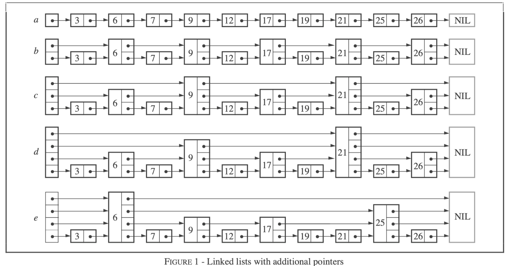

# MemTable模块

在DB::Get()的操作流程中我们可知，在读取操作时首先读取MemTable，然后读取Immutable MemTable，这两者都是在内存中的，最后才会去磁盘上的SSTable中进行读取。而在进行写入操作时，会先将操作以WAL的形式写入到Log之中，之后会按照Log写入的顺序，依次解析每一条Log，将Log中的操作应用于该Log文件对应的Memtable中。

Log文件和MemTable是一一对应的关系，只有当MemTable的大小超过设定的阈值，并成功生成SSTable且刷新到磁盘上之后(fsync)，对应的Log文件才能被删除。之后会使用一个新的MemTable对象。

还有我们上面介绍到的崩溃恢复部分，会从上次未持久化的Log文件（没有成功生成新的SSTable，以日志文件形式存在于磁盘中）中解析并应用Log，该过程中同样会生成一个新的MemTable。

这里主要阅读与MemTable相关的代码，关于MemTable的定义、表示和具体实现，以及相关用法。 在LevelDB中，MemTable其实是对**SkipList**（跳表）数据结构的封装。MemTable相关的定义放在了MemTable.h和MemTable.cc文件中，主要包括了Get、Add、NewIterator等的点查找、添加、新建迭代器访问等操作

## MemTable::Add()

MemTable中的add操作代表了一次修改，这个修改可能是Insert也可能是Delete。统一以一条Entry的格式插入到MemTable中，Entry的具体格式如下：

```c++
// Format of an entry is concatenation of:
//  key_size     : varint32 of internal_key.size()，是key+tag的总长度
//  key bytes    : char[internal_key.size()]
//  tag          : uint64((sequence << 8) | type)
//  value_size   : varint32 of value.size()
//  value bytes  : char[value.size()]
```

Add操作会根据传入的参数信息，用压缩编码的方式构造出一个Entry，最后将其插入到底层数据结构跳表中。每一个MemTable都会使用一个Arena内存池进行内存管理，

## MemTable查找

Memtable的查找分为Get()和Iterator查找两种，前者是点查询，后者可以遍历。首先一定要知道LookUpKey，具体请见dbformat.h文件中的定义，LookUpKey=userkey_len+userkey+sequencenumber(Tag)，在MemTable中查找kv对时需要通过LookUpKey，Get和Iterator方法皆是如此。

### MemTable::Get()

MemTable基于自身的跳表数据结构构造了一个迭代器，输入Lookupkey::memtable_key，进行点查询。

- 如果发现Memtable中存在该key对应的entry，则进一步判断该entry当前是还存在还是已经被delete了，若存在则返回查找结果，若已经被delete则返回NotFound。
- 若Memtable中不存在该key对应的entry，则说明没存在过，返回false。

重点在于构造的迭代器，迭代器本身是基于skiplist进行构造的，因此需要了解SkipList的插入、删除、查找原理。

### MemTable::Iterator()

基于跳表生成一个迭代器，本质上是调用的跳表中的迭代器，下面会单独开一个章节介绍跳表。

# SkipList

LevelDB 是一个单机的 KV 存储引擎。KV 引擎在本质上可认为只提供对数据条目（key，val） `Put(key, val), Get(key) val, Delete(key)` 操作的三个接口。而在实现上，LevelDB 在收到删除请求时不会真正删除数据，而是为该 Key 写一个特殊标记，以备读取时发现该 Key 不存在，从而将 `Delete` 转为 `Put` ，进而将三个接口简化为两个。砍完这一刀后，剩下的就是在 `Put` 和 `Get` 间进行性能取舍，LevelDB 的选择是：**牺牲部分 `Get` 性能，换取强悍 `Put` 性能，再极力优化 `Get`**。

我们知道，在存储层次体系（[Memory hierarchy](https://en.wikipedia.org/wiki/Memory_hierarchy)）中，内存访问远快于磁盘，因此 LevelDB 为了达到目标做了以下设计：

1. *写入（Put）*：让所有写入都发生在**内存**中，然后达到一定尺寸后将其批量刷**磁盘**。
2. *读取（Get）*：随着时间推移，数据不断写入，内存中会有一小部分数据，磁盘中有剩余大部分数据。读取时，如果在内存中没命中，就需要去磁盘查找。

为了保证写入性能，同时优化读取性能，需要内存中的存储结构能够同时支持高效的**插入**和**查找**。

之前听说 LevelDB 时，最自然的想法，以为该内存结构（memtable）为是[平衡树](https://en.wikipedia.org/wiki/Self-balancing_binary_search_tree)，比如[红黑树](https://en.wikipedia.org/wiki/Red–black_tree)、[AVL 树](https://en.wikipedia.org/wiki/AVL_tree)等，可以保证插入和查找的时间复杂度都是 lg (n)，看源码才知道用了跳表。相比平衡树，跳表优势在于，在保证读写性能的同时，大大简化了实现。

此外，为了将数据定期 dump 到磁盘，还需要该数据结构支持高效的顺序遍历。总结一下 LevelDB 内存数据结构（memtable）需求点：

1. 高效查找
2. 高效插入
3. 高效顺序遍历

## 原理

跳表由 William Pugh 在 1990 年提出，相关论文为：[Skip Lists: A Probabilistic Alternative to Balanced Trees](https://15721.courses.cs.cmu.edu/spring2018/papers/08-oltpindexes1/pugh-skiplists-cacm1990.pdf)。从题目可以看出，作者旨在设计一种能够替换平衡树的数据结构，正如他在开篇提到：

跳表是一种可以取代平衡树的数据结构。跳表使用**概率均衡**而非严格均衡策略，从而相对于平衡树，大大简化和加速了元素的插入和删除。

### 链表与跳表

简言之，**跳表就是带有额外指针的链表**。为了理解这个关系，我们来思考一下优化有序链表查找性能的过程。

假设我们有个有序链表，可知其查询和插入复杂度都为 O (n)。相比数组，链表不能进行二分查找的原因在于，不能用下标索引进行常数复杂度数据访问，从而不能每次每次快速的筛掉现有规模的一半。那么如何改造一下链表使之可以进行二分？

- 利用 map 构造一个下标到节点的映射？这样虽然可以进行二分查询了，但是每次插入都会引起后面所有元素的下标变动，从而需要在 map 中进行 O (n) 的更新。

- 增加指针使得从任何一个节点都能直接跳到其他节点？那得构造一个全连接图，指针耗费太多空间不说，每次插入指针的更新仍是 O (n) 的。

跳表给出了一种思路，**跳步采样，构建索引，逐层递减**。下面利用论文中的一张图来详细解释下。



如上图，初始我们有个带头结点的有序链表 a，其查找复杂度为 O (n)。然后，我们进行跳步采样，将采样出的节点按用指针依次串联上，得到表 b，此时的查找复杂度为 O (n/2 + 1) 。其后，我们在上次采样出的节点，再次进行跳步采样，并利用指针依次串联上，得到表 c，此时的查找复杂为 O (n/4 + 2)。此后，我们重复这个跳步采样、依次串联的过程，直到采样出的节点只剩一个，如图 e，此时的查找复杂度，可以看出为 O (log2n))。

代价是我们增加了一堆指针，增加了多少呢？我们来逐次考虑这个问题。从图中可以看出，每次采样出多少节点，便会增加多少个指针；我们的采样策略是，每次在上一次的节点集中间隔采样，初始节点数为 n，最后采到只剩一个节点为止。将其加和则为：(n/2 + n/4 + … + 1) = n。这和一个节点为 n 的二叉树的指针数是相同的。

### 跳表和平衡树

在实践中，我们常用搜索二叉树作为字典表或者顺序表。在插入过程中，如果数据在 key 空间具有很好地随机性，那么二叉搜索树每次顺序插入就可以维持很好的查询性能。但如果我们顺序的插入数据，则会使得二叉搜索树严重失衡，从而使读写性能都大幅度退化。

AVL可以始终将左右子树的高度保持在1的差距，这就意味着插入有可能会触发大量的调整操作；因此出现了红黑树，红黑树相比于AVL进一步的放宽了平衡要求，他只要求根节点到每个叶子结点的黑色节点相同即可。在放弃一定的查找性能的同时，减少了调整操作的开销。但是AVL和红黑树的旋转策略和复杂度其实实现起来要时间的。

而跳表在保证同样查询效率的情况下，使用了一种很巧妙的转化，大大简化了插入的实现。我们不能保证所有的插入请求在 key 空间具有很好地随机性，或者说均衡性；但我们可以控制每个节点其他维度的均衡性。比如，跳表中每个节点的指针数分布的**概率均衡**。

### 概率均衡

为了更好地讲清楚这个问题，我们梳理一下跳表的结构和所涉及到概念。跳表每个节点都会有 1 ~ MaxLevel 个指针，有 k 个指针的节点称为 *k 层节点*（level k node）；所有节点的层次数的最大值为跳表的*最大层数*（MaxLevel）。**跳表带有一个空的头结点，头结点有 MaxLevel 个指针。**

按前面从有序链表构建跳表的思路，每次插入新节点就变成了难题，比如插入的节点需要有多少个指针？插入后如何才能保证查找性能不下降（即维持采样的均衡）？

为了解决这个问题， Pugh 进行了一个巧妙的转化：将*全局、静态*的构建索引拆解为*独立、动态*的构建索引。其中的关键在于**通过对跳表全局节点指针数概率分布的维持，达到对查询效率的保持**。分析上面见索引逐层采样的过程我们可以发现，建成的跳表中有 50% 的节点为 1 层节点，25% 的节点为 2 层节点，12.5% 的节点为三层节点，依次类推。若能维持我们构造的跳表中的节点具有同样的概率分布，就能保证差不多查询性能。这在直觉上似乎没问题，这里不去深入探讨背后的数学原理，感兴趣的同学可以去读一读论文。

经过这样的转化，就解决了上面提出的两个问题：

1. 插入新节点的指针数通过独立的计算一个概率值决定，使全局节点的指针数满足几何分布即可。
2. 插入时不需要做额外的节点调整，只需要先找到其需要放的位置，然后修改他和前驱的指向即可。

这样插入节点的时间复杂度为查找的时间复杂度 O(log~2~n)，与修改指针的复杂度 `O(1)` *[注 3]* 之和，即也为 O(log~2~n)，删除过程和插入类似，也可以转化为查找和修改指针值，因此复杂度也为 O(log~2~n)。

> 注意采样的概率p和总层数是可以根据具体情况调整的。

# LevelDB的跳表(内存屏障与Flexiable Array的用法)

LevelDB对跳表的实现增加了多线程并发访问方面的支持：

1. Write：在修改跳表时，需要在用户代码侧加锁。
2. Read：在访问跳表（查找、遍历）时，只需保证跳表不被其他线程销毁即可，不必额外加锁。

也就是说，用户侧只需要处理写写冲突，**LevelDB 跳表保证没有读写冲突**。这是因为在实现时，LevelDB 做了以下假设（Invariants）：

1. 除非跳表被销毁，跳表节点只会增加而不会被删除，因为跳表对外根本不提供删除接口。这一点是由MemTable的AppendOnly特性决定的。删除操作同样由一个新Node所代表。
2. 被插入到跳表中的节点，除了 next 指针其他域都是不可变的，并且只有插入操作会改变跳表。

具体内容需要看代码，这里还涉及到了Flexible Array(柔性数组)和std::atomic的内存屏障的使用。

[大白话解析LevelDB：SkipList（跳表）_leveldb skiplist-CSDN博客](https://blog.csdn.net/sinat_38293503/article/details/134643628)

[漫谈 LevelDB 数据结构（一）：跳表（Skip List） | 木鸟杂记 (qtmuniao.com)](https://www.qtmuniao.com/2020/07/03/leveldb-data-structures-skip-list/)

## 多线程同步-C++11的内存序

LevelDB的跳表使用了Template Class进行编写，因为我们需要考虑到多线程读写，所以需要考虑同步问题，而LevelDB在插入新节点的时候，通过内存屏障实现多线程同步。

我们知道，编译器 / CPU 在保在**达到相同效果**（最终的结果是相同的）的情况下会按需（加快速度、内存优化等）对指令进行重排，这对单线程来说的确没什么。但是对于多线程，指令重排会使得多线程间代码执行顺序变的各种反直觉。比如用下面的go程序举例：

```go
var a, b int

func f() {
  a = 1
  b = 2
}

func g() {
  print(b)
  print(a)
}

func main() {
  go f()
  g()
}
```

该代码片段可能会打印出 `2 0`。原因在于编译器 / CPU 将 `f()` 赋值顺序重排了或者将 `g()` 中打印顺序重排了。

这就意味着你跟随直觉写出的多线程代码，可能会出问题。因为你无形中默认了单个线程中执行顺序是代码序，多线程中虽然代码执行会产生交错，但仍然保持各自线程内的代码序。实则不然，由于编译器 / CPU 的指令重排，如果不做显式同步，你不能对多线程间代码执行顺序有任何假设。

C++11 中 atomic 标准库中定义了6种内存序列，规定了一些指令重排方面的限制，内存序一般配合std::atomic这种无锁类型的线程安全类一同使用：

1. `memory_order_relaxed` ：不提供任何顺序保证。 【**注意这个只保证单个操作的原子性不包括内存顺序**】
2. `memory_order_consume` - 仅限于依赖于原子操作的特定数据。**已经不怎么用了**
3. `std::memory_order_acquire`: 用于load操作（代表广义的读操作，因为任何读操作的底层都是一个load指令） 。保证同线程中该 load 之后的对相关内存读写语句不会被重排到 load 之前，并且其他线程中对同样内存用了 store 的release内存序的操作都对该线程可见。
4. `std::memory_order_release`：用于store 操作（代表广义的写操作，因为大多数写操作的底层都是一个store指令）。保证同线程中该 store 之后的对相关内存的读写语句不会被重排到 store 之前，并且该线程的所有修改对用了 load acquire 的其他线程都可见。
5. `memory_order_acq_rel` - 同时包含acquire和release的语义。
6. `memory_order_seq_cst` - 提供顺序一致性，是最强的内存序。

LevelDB中主要用到了`memory_order_relaxed` ，`std::memory_order_acquire`，`std::memory_order_release`这三种内存序列。

## SkipList::Node的内存序应用

Node的SetNext和Next方法提供了有内存屏障和无内存屏障的两个版本。具体请见skiplist.h文件。注意LevelDB采用了Arena内存池自行管理内存，因此有必要说明一下NewNode函数中的一个用法：

```c++
template <typename Key, class Comparator>
typename SkipList<Key, Comparator>::Node* SkipList<Key, Comparator>::NewNode(
    const Key& key, int height) {
      // 这里分配的内存包含两部分:
      // 1. Node对象本身，大小为sizeof(Node)
      // 2. Node对象的next_数组，大小为sizeof(std::atomic<Node*>) * (height - 1)，
      // 因为Node对象中的next_数组本身已经包含了一个指针空间，所以这里只需要分配height - 1个指针空间即可
  char* const node_memory = arena_->AllocateAligned(
      sizeof(Node) + sizeof(std::atomic<Node*>) * (height - 1));
      // 与new Node(key)不同，这里是在arena_上分配内存，而不是在堆上分配内存
  return new (node_memory) Node(key);
}
```

我们可以注意到最后返回的是`new (node_memory) Node(key)`，而不是`new Node(key)`。

`new (node_memory) Node(key)` 是所谓的定位 `new` 运算符，它与普通的 `new` 运算符稍有不同。

普通的 `new` 运算符用于在动态内存中分配一个新的对象，并在分配的内存上调用对象的构造函数进行初始化。例如，`new Node(key)` 会分配足够的内存以存储一个 `Node` 对象，并调用 `Node` 类的构造函数将 `key` 传递给该构造函数以初始化新创建的节点对象。

而定位 `new` 运算符 `new (node_memory) Node(key)` 则是在给定的内存地址 `node_memory` 上调用对象的构造函数进行初始化。它允许程序员控制对象在内存中的位置。在这种情况下，`node_memory` 是一个指向预先分配好的内存块的指针，通过定位 `new` 运算符，我们告诉编译器在这块内存上构造一个 `Node` 对象，并使用给定的参数 `key` 调用 `Node` 类的构造函数。

总的来说，区别在于：

- 普通的 `new` 运算符用于在动态内存中分配对象，并进行初始化。
- 定位 `new` 运算符用于在给定的内存地址上进行对象的构造和初始化。

## MemTable生成SSTable-Compaction操作

LevelDB是基于LSM树的，对于写操作，会先将数据写入内存，当内存表大于某个阈值时，需要将其作为SSTable写入到磁盘。LevelDB中，当MemTable大小超出配置值后，则会触发生成SSTable并写盘的过程，具体功能函数请见`db/db_impl.cc`中的`WriteLevel0Table`函数。

这就与前面介绍的崩溃恢复接上了，当数据库读取磁盘中的log做恢复操作时，若MemTable大小超过了阈值，同样会触发MemTable的生成，写入磁盘成功之后，memtable的内存会被释放。RecoveLogFile->WriteLevel0Table。

这里涉及到了TableBuilder、TableCache、Meta等一系列的类，在后面的会逐步阅读这些代码。

# SSTable