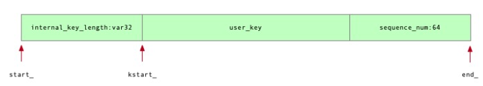

# LevelDB的写入流程

## kv的写入

这块前面介绍的基础类息息相关，LevelDB的写入流程大概会经历如下阶段，就是DBImpl::Write函数：

1. 写入的kv对会首先被封装到WriteBatch结构体中。
2. WriteBatch中封装了一批操作数据，之后将每一个WriteBatch对象封装到一个DBImpl::Writer对象中，DBImpl::Writer中添加了一些多线程同步操作所必需的同步原语。
3. 在2的基础之上，实际上写入流程调用的是DBImpl::Write，而每个Write操作中都会有一个writers队列，之后依次处理每个writer。当writer中的内容被写入到Log文件中时，释放锁，期间允许新的writer入队列，从而增加一定程度的并发性。
4. 当操作都写入到Log文件后，就可以将其写入到memtable中，之后用户就能看到这些操作了。

操作的log写盘，之后可以应用到memtable，这个过程没有锁的保护，但实际上writer队列中每次只允许头部的writer执行操作，因此可以保证每个时刻只会有一个writer在被写盘、应用到memtable。

leveldb用户通过调用write或者put函数向数据库中写入数据实际上是将数据写入到levedb的Memtable中。我们也曾经提到过，leveldb中有两个MemTable，分别是imm_和mem\_，其中imm\_是不可写的，若Imm\_不为null，则说明imm\_正在被compact为SSTable。

leveldb提供持久化，也就是需要将内存中的数据保存到磁盘上，也就是前面说的以sstable的形式将数据持久化。在leveldb中，内存中的每个memtable对应磁盘上的每个sstable，一般情况下我们不希望文件太大，因此必须控制memtable中的数据量，当达到一定的阀值时就要将其写盘。leveldb提供异步写盘的方式，这就是imm\_的作用，每次mem\_中的数据够多时，就将mem\_复制给imm\_，两者都是指针，所以复制操作很快)，并让mem\_指向一个重新申请的memTable。交换之前保证imm为空，然后mem\_就可以继续接受用户的数据，同时leveldb开启一个背景线程将imm_写入磁盘。

> DBImpl::MakeRoomForWrite函数起到了一个检查当前MemTable、Immutable_memtable、磁盘上Level0的SSTables的数量的状态的功能，以决定写入操作是否能继续执行，或者继续等待。
>
> 相关的规定限制都在dbformat.h中，里面规定了Level0层的文件数量达到多少时会延迟、会停止等待，等等。

具体的内容等看到compact操作部分时，会有更深的理解。

### 关于Background Thread

在DBImpl::MakeRoomForWrite函数中，可以看到，每个时刻，leveldb只允许一个background线程存在，这里需要加锁主要也是这个原因，防止某个瞬间两个线程同时开启背景线程。当确定当前数据库中没有背景线程，也不存在错误，同时确实有工作需要背景线程来完成，就通过env\_->Schedule(&DBImpl::BGWork, this)启动背景线程，前面的bg_compaction_scheduled_设置主要是告诉其他线程当前数据库中已经有一个背景线程在运行了。

## SSTable中data block的生成

承接上面，当kv的操作被写入到log文件后，就可以进一步的写到memtable中，当memtable的大小达到一定的阈值后，就会触发memtable->SSTable的转换，之前已经学习过了SSTable是以块为基本进行保存的，SSTable包括data block、fliter block、data index block、meta index block、footer几种类型，下面主要介绍块是如何生成的。

主要参考LevelDB中的Block_builder.h和block_builder.cc文件中的BlockBuilder类，该类会根据kv对，按照data block中的格式，生成一个data block。

### 读取Block

读取一个Data Block并且在该block中查找一个kv对，需要一个基于block实现一个iterator，具体可见Block.h和block.cc文件，根据data block的数据格式，就能明白如何读取。

# 生成SSTable

之前已经了解过了一个SSTable中各种block是如何生成，如何读取的，接下来进一步了解如何生成一个完整的SSTable文件，相关代码在table_builder.h和table_builder.cc中，主要关注TableBuilder类。TableBuilder是一个集大成的结构体，是用于构建一个SSTable(Sorted String Table)的Table(即SSTable)的接口。因此不难理解，在一个TableBuilder中会包含多个BlockBuilder，用于构建Data Block、Filter Block、Data Index Block、Filter Index Block这些，最后加上Footer，就构成了一个完整的SSTable。下图是TableBuilder中的API串联思路：

具体的设计思想还是要看TableBuilder中代码的注释，写在了代码上面。总体来说，在向TableBuilder添加键值对的过程中，除了总大小到达阈值后会生成一个DataBlock， filter block与data index block也在被同步构建；每当一个Data Block构建完成后，对应的会在filter block中生成若干个filter data,同样会在data index block中生成一个index entry。

当所有的kv对被写入后，首先把最后一批可能存在的不足一个Data Block大小的键值对数据生成一个data block。之后就可以根据当前信息，先后添加filter block，meta index block，data index block，footer这些，之后就生成了一个完整的SSTable，里面有很多细节值得学习，还是看源码。

# LevelDB的读操作

首先，从宏观上来看，leveldb 数据读取经过三个阶段 :

- 从**MemTable**中查找数据
- 从**Immutable MemTable**(将要被刷到磁盘的MemTable)中查找数据
- 从SST中查找数据，重点学习的部分。

## MemTable中的查找逻辑-复习

MemTable的底层数据结构是跳表，因此查找是基于跳表的规则进行的。用户查询的UserKey会被封装成**LookupKey**结构进行查询，它本质就是一个**InternalKey**，他通过序列号支持查询历史版本，默认查询最新版本(`sequencenumber`取最大)。回顾一下Internal Key的格式：

它将`LookupKey`转换成与MemTable中维护的entry相近的一种表示: `|internal_key_len | user_key | sequence_number |`。它在内部基于`SkipList`查找大于等于用户提交的`internal_key`的数据(基于`InternalKeyComparator`的比较策略)。找到数据以后，因为拿到的是大于等于的结果，所以进行`user_key`与`ValueType`的精确比对查询。

这部分源码之前已经做过学习，并且有相关注释，可以具体查看。

## 读取SSTable-TwoLevelIterator思想

当我们需要从SSTable中读取数据时，会对Table类生成一个TwoLevelIterator进行读取，从名字来看，它是一个两层迭代器对象，第一层是Index Block的迭代器，通过遍历Index Block查找目标key应该所在的块的BlockHandle；

根据第一层迭代器获取到的BlockHandle，获取到目标Block的BlockContents，并构造BlockReader这个第二个迭代器，以读取目标块并找到对应的KV对。

要明白的是，无论是第一层还是第二层迭代器，他们本质上都是以Block对象为基础生成的迭代器，因此读取的逻辑是相似的，都遵守Block的内部格式。具体源码看table.cc，two_level_iterator.cc文件。

### TwoLevelIterator设计

双层迭代器, 对应的类为 `class leveldb::<unnamed>::TwoLevelIterator`, 位于 `table/two_level_iterator.cc` 文件. 它的父类为 `leveldb::Iterator`, 所以表现出来的性质是一样的.

该类设计比较巧妙, 这主要是由 sstable 文件结构决定的. 具体地, 要想在 sstable 文件中找到某个 key/value 对, 肯定先要找到它所属的 data Block, 而要找到 data Block 就要先在 index block 找到其对应的 BlockHandle. 双层迭代器就是这个寻找过程的实现.

该类包含两个迭代器封装：

- 一个是 index_iter_, 它指向 index block 数据项. 针对每个 data block 都有一个对应的 entry 包含在 index block 中, entry 包含一个 key/value 对, 其中：
  - key 为大于等于对应 data block 最后(也是最大的, 因为排序过了)一个 key 同时小于接下来的 data block 的第一个 key 的(比较拗口)字符串;
  - value 是指向一个对应 data block 的 BlockHandle.
- 另一个是 data_iter_, 它指向 data block 包含的数据项. 至于这个 data block 是否与 index_iter_ 所指数据项对应 data block 一致, 那要看实际情况, 不过即使不一致也无碍.

示意图如下:

这两个迭代器, 可以把 index_iter 看作钟表的时针, 指向具体小时, 可以把 data_iter_ 看作更精细的分针, 指向当前小时的具体分钟. 两个指针一起配合精确定位到我们要查询的数据。

# BloomFilter-布隆过滤器

