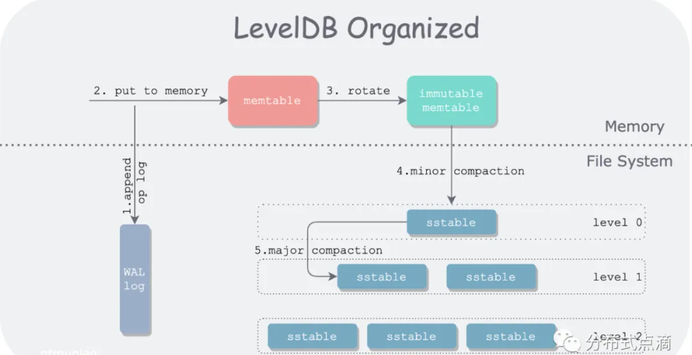
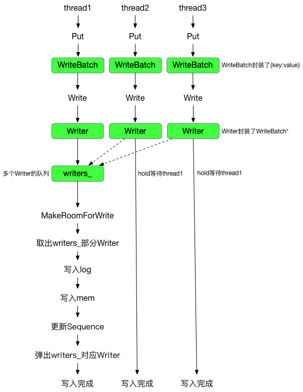
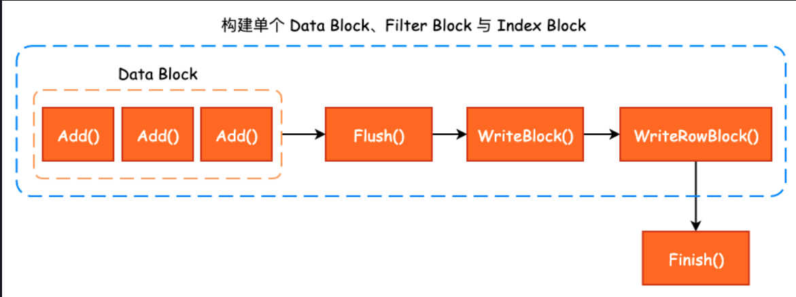
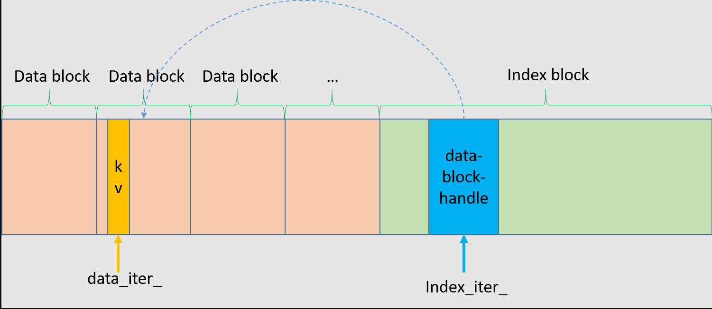
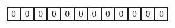
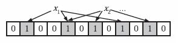
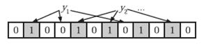

# LevelDB的写入流程

## 宏观上的写入流程



## kv的写入（LevelDB只支持单线程写入）



这块前面介绍的基础类息息相关，LevelDB的写入流程大概会经历如下阶段，就是DBImpl::Write函数：

1. 写入的kv对会首先被封装到WriteBatch结构体中。
2. WriteBatch中封装了一批操作数据，之后将每一个WriteBatch对象封装到一个DBImpl::Writer对象中，DBImpl::Writer中添加了一些多线程同步操作所必需的同步原语。
3. 在2的基础之上，实际上写入流程调用的是DBImpl::Write，而每个Write操作中都会有一个writers队列，之后依次处理每个writer。当writer中的内容被写入到Log文件中时，释放锁，期间允许新的writer入队列，从而增加一定程度的并发性。
4. 当操作都写入到Log文件后，就可以将其写入到memtable中，之后用户就能看到这些操作了。

操作的log写盘，之后可以应用到memtable，这个过程没有锁的保护，但实际上writer队列中每次只允许头部的writer执行操作，因此可以保证每个时刻只会有一个writer在被写盘、应用到memtable。

leveldb用户通过调用write或者put函数向数据库中写入数据实际上是将数据写入到levedb的Memtable中。我们也曾经提到过，leveldb中有两个MemTable，分别是imm_和mem\_，其中imm\_是不可写的，若Imm\_不为null，则说明imm\_正在被compact为SSTable。

leveldb提供持久化，也就是需要将内存中的数据保存到磁盘上，也就是前面说的以sstable的形式将数据持久化。在leveldb中，内存中的每个memtable对应磁盘上的每个sstable，一般情况下我们不希望文件太大，因此必须控制memtable中的数据量，当达到一定的阀值时就要将其写盘。leveldb提供异步写盘的方式，这就是imm\_的作用，每次mem\_中的数据够多时，就将mem\_复制给imm\_，两者都是指针，所以复制操作很快)，并让mem\_指向一个重新申请的memTable。交换之前保证imm为空，然后mem\_就可以继续接受用户的数据，同时leveldb开启一个背景线程将imm_写入磁盘。

> DBImpl::MakeRoomForWrite函数起到了一个检查当前MemTable、Immutable_memtable、磁盘上Level0的SSTables的数量的状态的功能，以决定写入操作是否能继续执行，或者继续等待。
>
> 相关的规定限制都在dbformat.h中，里面规定了Level0层的文件数量达到多少时会延迟、会停止等待，等等。

具体的内容等看到compact操作部分时，会有更深的理解。

### 关于Background Thread

在DBImpl::MakeRoomForWrite函数中，可以看到，每个时刻，leveldb只允许一个background线程存在，这里需要加锁主要也是这个原因，防止某个瞬间两个线程同时开启背景线程。当确定当前数据库中没有背景线程，也不存在错误，同时确实有工作需要背景线程来完成，就通过env\_->Schedule(&DBImpl::BGWork, this)启动背景线程，前面的bg_compaction_scheduled_设置主要是告诉其他线程当前数据库中已经有一个背景线程在运行了。

## SSTable中data block的生成

承接上面，当kv的操作被写入到log文件后，就可以进一步的写到memtable中，当memtable的大小达到一定的阈值后，就会触发memtable->SSTable的转换，之前已经学习过了SSTable是以块为基本进行保存的，SSTable包括data block、fliter block、data index block、meta index block、footer几种类型，下面主要介绍块是如何生成的。

主要参考LevelDB中的Block_builder.h和block_builder.cc文件中的BlockBuilder类，该类会根据kv对，按照data block中的格式，生成一个data block。

### 读取Block

读取一个Data Block并且在该block中查找一个kv对，需要一个基于block实现一个iterator，具体可见Block.h和block.cc文件，根据data block的数据格式，就能明白如何读取。

# 生成SSTable

之前已经了解过了一个SSTable中各种block是如何生成，如何读取的，接下来进一步了解如何生成一个完整的SSTable文件，相关代码在table_builder.h和table_builder.cc中，主要关注TableBuilder类。TableBuilder是一个集大成的结构体，是用于构建一个SSTable(Sorted String Table)的Table(即SSTable)的接口。因此不难理解，在一个TableBuilder中会包含多个BlockBuilder，用于构建Data Block、Filter Block、Data Index Block、Filter Index Block这些，最后加上Footer，就构成了一个完整的SSTable。下图是TableBuilder中的API串联思路：



具体的设计思想还是要看TableBuilder中代码的注释，写在了代码上面。总体来说，在向TableBuilder添加键值对的过程中，除了总大小到达阈值后会生成一个DataBlock， filter block与data index block也在被同步构建；每当一个Data Block构建完成后，对应的会在filter block中生成若干个filter data,同样会在data index block中生成一个index entry。

当所有的kv对被写入后，首先把最后一批可能存在的不足一个Data Block大小的键值对数据生成一个data block。之后就可以根据当前信息，先后添加filter block，meta index block，data index block，footer这些，之后就生成了一个完整的SSTable，里面有很多细节值得学习，还是看源码。

# LevelDB的读操作

首先，从宏观上来看，leveldb 数据读取经过三个阶段 :

- 从**MemTable**中查找数据
- 从**Immutable MemTable**(将要被刷到磁盘的MemTable)中查找数据
- 从SST中查找数据，重点学习的部分。

## MemTable中的查找逻辑-LookUpKey, internalKey, memtable key辨析

LookUpKey是InternalKey和memtable key的源头类，构造出LookUpKey后，可以从中分别得到后续两种key：

- internalKey是去掉key_length字段后剩余部分。
- memtableKey则是原封不动的返回LookUpKey的内容。

MemTable的底层数据结构是跳表，因此查找是基于跳表的规则进行的。用户查询的UserKey会被封装成**LookupKey**结构进行查询，在memtable中进行查找时，构造一个LookUpKey后，从中提取出memtableKey进行查找即可。

```c++
  // We construct a char array of the form:
  //    klength  varint32               <-- start_
  //    userkey  char[klength]          <-- kstart_
  //    tag      uint64
  //                                    <-- end_
  // The array is a suitable MemTable key.
  // The suffix starting with "userkey" can be used as an InternalKey.
  // 这个数组是一个合适的MemTable key。
  // 以"userkey"开头的后缀可以用作InternalKey。
```

## 读取SSTable-TwoLevelIterator思想

当我们需要从SSTable中读取数据时，会对Table类生成一个TwoLevelIterator进行读取，从名字来看，它是一个两层迭代器对象，第一层是Index Block的迭代器，通过遍历Index Block查找目标key应该所在的块的BlockHandle；

根据第一层迭代器获取到的BlockHandle，获取到目标Block的BlockContents，并构造BlockReader这个第二个迭代器，以读取目标块并找到对应的KV对。

要明白的是，无论是第一层还是第二层迭代器，他们本质上都是以Block对象为基础生成的迭代器，因此读取的逻辑是相似的，都遵守Block的内部格式。具体源码看table.cc，two_level_iterator.cc文件。

### TwoLevelIterator设计

双层迭代器, 对应的类为 `class leveldb::<unnamed>::TwoLevelIterator`, 位于 `table/two_level_iterator.cc` 文件. 它的父类为 `leveldb::Iterator`, 所以表现出来的性质是一样的.

该类设计比较巧妙, 这主要是由 sstable 文件结构决定的. 具体地, 要想在 sstable 文件中找到某个 key/value 对, 肯定先要找到它所属的 data Block, 而要找到 data Block 就要先在 index block 找到其对应的 BlockHandle. 双层迭代器就是这个寻找过程的实现.

该类包含两个迭代器封装：

- 一个是 index_iter_, 它指向 index block 数据项. 针对每个 data block 都有一个对应的 entry 包含在 index block 中, entry 包含一个 key/value 对, 其中：
  - key 为大于等于对应 data block 最后(也是最大的, 因为排序过了)一个 key 同时小于接下来的 data block 的第一个 key 的(比较拗口)字符串;
  - value 是指向一个对应 data block 的 BlockHandle.
- 另一个是 data_iter_, 它指向 data block 包含的数据项. 至于这个 data block 是否与 index_iter_ 所指数据项对应 data block 一致, 那要看实际情况, 不过即使不一致也无碍.

示意图如下：



这两个迭代器, 可以把 index_iter 看作钟表的时针, 指向具体小时, 可以把 data_iter_ 看作更精细的分针, 指向当前小时的具体分钟. 两个指针一起配合精确定位到我们要查询的数据。

# BloomFilter-布隆过滤器

布隆过滤器用于检查一个元素是否存在于一个集合中，用固定大小的内存空间和指令数量的哈希函数判断元素是否存在。若布隆判断一个元素不存在，则肯定不存在；若判断一个元素存在，那么这个元素可能存在，也可能不存在，即存在一定的误判率。

bloom filter是一种数据结构，作用类似于 hash table，相对于后者，空间利用率更高。一般来说，若集合中元素较少，可以直接用hash table来实现，读写都是O(1)复杂度，并可以准确的判断元素是否存在。但是随着数据量增大，比如搜索引擎需要检索全网的数据，则使用hash table需要的内存空间会同步线性增长，因此需要bloom filter这种数据结构来解决这个问题。

## 工作原理

bloom filter的基本原理为：使用**m bit**的数组作为存储空间，使用**k**个哈希函数进行计算。每次查找一个元素时，首先通过k个哈希函数分别计算该元素的哈希值，之后判断哈希值对应位置的比特数组元素是否为1，若果有任意一个元素不为1，则说明该元素不存在。插入元素也同理，通过哈希函数计算出对应的哈希值，之后将比特数组中对应的位置都置为1即可。

因为在插入过程中元素直接对应的bit位难免会碰撞(重合)，因此bloom不支持删除元素，因为删除操作有可能导致将其他元素的位也清除。

可见，若比特数组m过小，则很快所有bit位都会为1，那么查询任何值都会返回true，此时就没有了过滤的意义。同时，若哈希函数个数k过多，则每次操作都需要大量计算，bloom的效率变低。而若哈希函数个数太少，则元素之间发生碰撞的概率会变大，从而误报率也会增大。所以需要知道如何选取m和k的值。这里存在一个tradeoff，是bloom filter 是关于空间和误报率的 tradeoff。假设有**n**个总元素，直接上公式结论：
$$
k=(m/n)*ln2
$$
假设空间大小m确定，也可以确定元素的总个数n，则应用此公式可以得到一个误报率最低的k值，即这种方法可以在空间代价和误报率之间得到一个平衡。

## 图解

Bloom Filter是一种空间效率很高的随机数据结构，它利用位数组很简洁地表示一个集合，并能判断一个元素是否属于这个集合。Bloom Filter的这种高效是有一定代价的：在判断一个元素是否属于某个集合时，有可能会把不属于这个集合的元素误认为属于这个集合（false positive）。因此，Bloom Filter不适合那些“零错误”的应用场合。而在能容忍低错误率的应用场合下，Bloom Filter通过极少的错误换取了存储空间的极大节省。

leveldb中利用布隆过滤器判断指定的key值是否存在于sstable中，若过滤器表示不存在，则该key一定不存在，由此加快了查找的效率。bloom过滤器底层是一个位数组，初始时每一位都是0：



当插入值x后，分别利用k个哈希函数（图中为3）利用x的值进行散列，并将散列得到的值与bloom过滤器的容量进行取余，将取余结果所代表的那一位值置为1。



一次查找过程与一次插入过程类似，同样利用k个哈希函数对所需要查找的值进行散列，只有散列得到的每一个位的值均为1，才表示该值“**有可能**”真正存在；反之若有任意一位的值为0，则表示该值一定不存在。例如y1一定不存在；而y2可能存在。



## 相关数学结论

http://blog.csdn.net/jiaomeng/article/details/1495500该文中从数学的角度阐述了布隆过滤器的原理，以及一系列的数学结论。

首先，与布隆过滤器准确率有关的参数有：

- 哈希函数的个数k；
- 布隆过滤器位数组的容量m;
- 布隆过滤器插入的数据数量n;

主要的数学结论有：

1. 为了获得最优的准确率，当k = ln2 * (m/n)时，布隆过滤器获得最优的准确性；
2. 在哈希函数的个数取到最优时，要让错误率不超过є，m至少需要取到最小值的1.44倍；

至于如何得出这些结论的，具体请见上面的博客，并且可以看看原论文。

## LevelDB的实现

具体见bloom.cc中的实现，LevelDB有一个Filter policy纯虚类，用户可以自行定义过滤器规则，LevelDB自带的就是基于此实现的BloomFilterPolicy。LevelDB中的bloom filter并没有真的用K_个哈希函数，而是采用了模拟生成K\_个哈希值的方法。此外，每个过滤器的尾部都会存储一个size_t值，该值代表了这个过滤器使用了多少个hash函数。写入与读取bloom filter的过程是相似的，都是用相同的Hash函数与相同的Delta值。

LevelDB在具体使用bloom filter时，又封装了FilterBlockBuilder和FilterBlockReader这两个类。Builder是用来调用BloomFilterPolicy的CreateFilter方法生成布隆过滤器，并将其写入到filter block。而Reader是用来读取SSTable中的filter data block，之后找到对应的filter data，然后通过BloomFilterPolicy的KeyMayMatch方法判断该元素是否存在。这两个类之前已经阅读过源码，可以回头看看注释，加深理解。

## LevelDB读操作

在查找一个key时，若Memtable中不存在该键，则需要逐层读取SSTable。读取SSTable之前，先通过bloom filter判断是否存在该键，如果不存在就直接返回；如果存在，则需要先将磁盘中的SSTable文件内容读取到内存保存。若该SSTable已经在内存中存在，则只需要进行一次内存读取操作；若该SSTable在内存中不存在，则需要增加一次磁盘读取操作。

具体的逻辑在Table::InternalGet()函数中，我们已经找到了一个目标表(SSTable)，之后定位到目标data block后，首先通过其对应的filter data，提前确定该key是否在该这个data block中。

理论上，我们希望经常使用多个SSTable内容尽量保存在内存中，但是现实中磁盘中的SSTable总大小一般会大于服务器内存大小，因此LevelDB提供了LRU Cache来管理内存。

