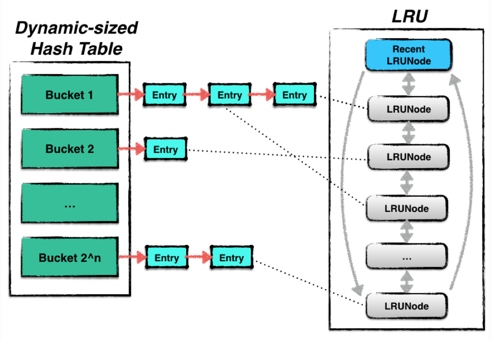
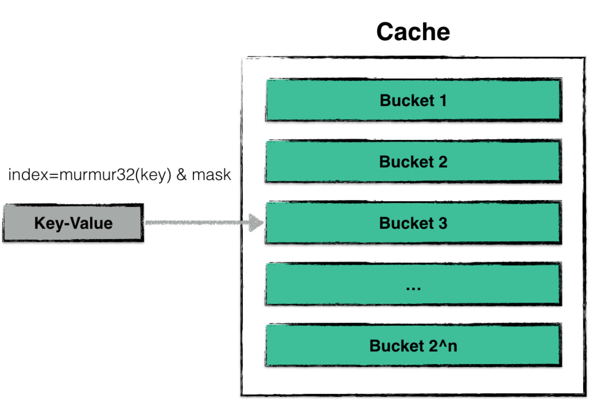
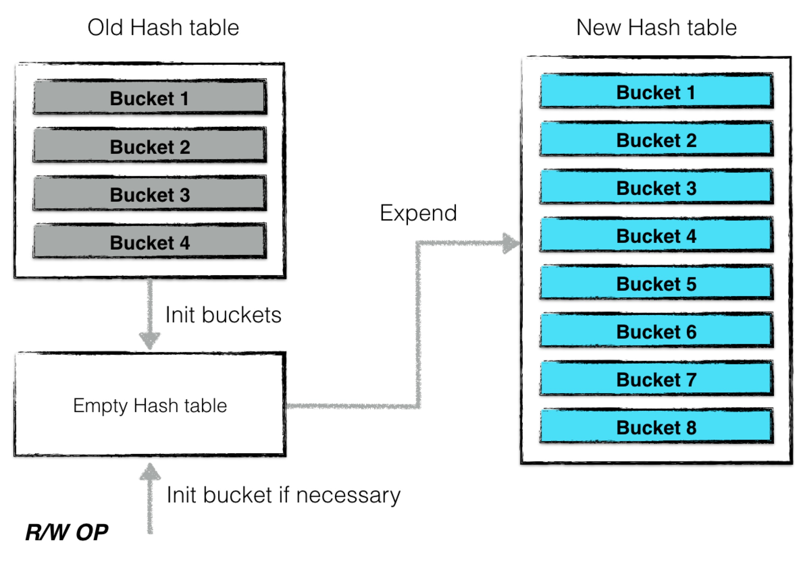
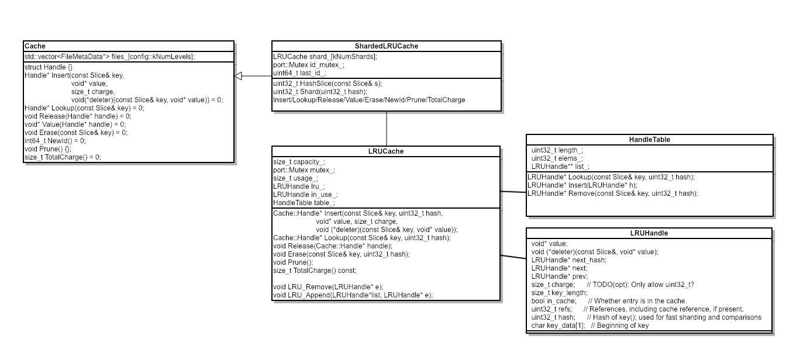
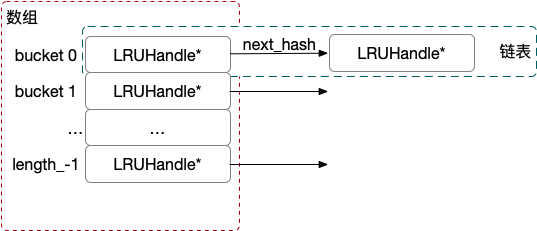
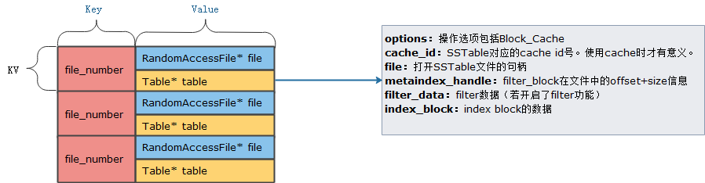
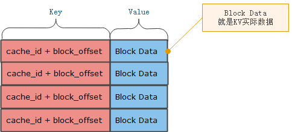

# LevelDB的Cache系统-理论分析

缓存对于一个数据库读性能的影响十分巨大，倘若leveldb的每一次读取都会发生一次磁盘的IO，那么其整体效率将会非常低下。Leveldb中使用了一种基于LRUCache的缓存机制，用于缓存：

- 已打开的sstable文件对象和相关元数据；对应TableCache。
- sstable中的dataBlock的内容；对应BlockCache。

使得在发生读取热数据时，尽量在cache中命中，避免IO读取。源码部分见LRUCache的使用。

## Cache结构

leveldb中使用的cache是一种LRUcache，其结构由两部分内容组成：

- Hash table：用来存储数据；
- LRU：用来维护数据项的新旧信息；

其中Hash table是基于Yujie Liu等人的论文《Dynamic-Sized Nonblocking Hash Table》实现的，用来存储数据。由于hash表一般需要保证插入、删除、查找等操作的时间复杂度为 O(1)。

当hash表的数据量增大时，为了保证这些操作仍然保有较为理想的操作效率，需要对hash表进行resize，即改变hash表中bucket的个数，对所有的数据进行重散列。

基于该文章实现的hash table可以实现resize的过程中**不阻塞其他并发的读写请求**。

LRU中则根据Least Recently Used原则进行数据新旧信息的维护，当整个cache中存储的数据容量达到上限时，便会根据LRU算法自动删除最旧的数据，使得整个cache的存储容量保持一个常量。

具体定义见cache.h和cache.cc文件。cache.h中定义的Cache类相当于一个接口父类，因为里面的接口大多是纯虚函数。而具体的LRUCache，ShardedLRUCache，都在table.cc文件中定义。

leveldb利用上述的cache结构来缓存数据。其中：

- cache：来缓存已经被打开的sstable文件句柄以及元数据（默认上限为500个）；
- bcache：来缓存被读过的sstable中dataBlock的数据（默认上限为8MB）;

当一个sstable文件需要被打开时，首先从cache中寻找是否已经存在相关的文件句柄，若存在则无需重复打开；若不存在，则从打开相关文件，并将（1）indexBlock数据，（2）metaIndexBlock数据等相关元数据进行预读。

## Dynamic-sized NonBlocking Hash table

在hash表进行resize的过程中，保持Lock-Free是一件非常困难的事。

一个hash表通常由若干个bucket组成，每一个bucket中会存储若干条被散列至此的数据项。当hash表进行resize时，需要将“旧”桶中的数据读出，并且重新散列至另外一个“新”桶中。假设这个过程不是一个原子操作，那么会导致此刻其他的读、写请求的结果发生异常，甚至导致数据丢失的情况发生。

因此，liu等人提出了一个新颖的概念：**一个bucket的数据是可以冻结的**。

这个特点极大地简化了hash表在resize过程中在不同bucket之间转移数据的复杂度。

### 散列

该哈希表的散列与普通的哈希表一致，都是借助散列函数，将用户需要查找、更改的数据散列到某一个哈希桶中，并在哈希桶中进行操作。

由于一个哈希桶的容量是有限的（一般不大于32个数据），因此在哈希桶中进行插入、查找的时间复杂度可以视为是常量的。

### 扩大

当cache中维护的数据量太大时，会发生哈希表扩张的情况。以下两种情况是为“cache中维护的数据量过大”：

- 整个cache中，数据项（node）的个数超过预定的阈值（默认初始状态下哈希桶的个数为16个，每个桶中可存储32个数据项，即总量的阈值为哈希桶个数乘以每个桶的容量上限）；
- 当cache中出现了数据不平衡的情况。当某些桶的数据量超过了32个数据，即被视作数据发生散列不平衡。当这种不平衡累积值超过预定的阈值（128）个时，就需要进行扩张；

一次扩张的过程为：

1. 计算新哈希表的哈希桶个数（扩大一倍）；
2. 创建一个空的哈希表，并将旧的哈希表（主要为所有哈希桶构成的数组）转换一个“过渡期”的哈希表，表中的每个哈希桶都被“冻结”；
3. 后台利用“过渡期”哈希表中的“被冻结”的哈希桶信息对新的哈希表进行内容构建；

**值得注意的是，在完成新的哈希表构建的整个过程中，哈希表并不是拒绝服务的，所有的读写操作仍然可以进行**。**哈希表扩张过程中，最小的封锁粒度为哈希桶级别**。

当有新的读写请求发生时，若被散列之后得到的哈希桶仍然未构建完成，则“主动”进行构建，并将构建后的哈希桶填入新的哈希表中。后台进程构建到该桶时，发现已经被构建了，则无需重复构建。

因此如上图所示，哈希表扩张结束，哈希桶的个数增加了一倍，与此同时仍然可以对外提供读写服务，仅仅需要哈希桶级别的封锁粒度就可以保证所有操作的一致性跟原子性。

#### **构建哈希桶**

当哈希表扩张时，构建一个新的哈希桶其实就是将一个旧哈希桶中的数据拆分成两个新的哈希桶。

拆分的规则很简单。由于一次散列的过程为：

1. 利用散列函数对数据项的key值进行计算；
2. 将第一步得到的结果取哈希桶个数的余，得到哈希桶的ID；

因此拆分时仅需要将数据项key的散列值对新的哈希桶个数取余即可。

### 缩小

当哈希表中数据项的个数少于哈希桶的个数时，需要进行收缩。收缩时，哈希桶的个数变为原先的一半，2个旧哈希桶的内容被合并成一个新的哈希桶，过程与扩张类似，在这里不展开详述。

# LevelDB的Cache系统-源码解析

## 定义

从前面的文章已经可以了解到，LRU 的实现需要两个数据结构：

1. HashTable: 用于实现O(1)的查找
2. List: 存储 Least recently 排序，用于旧数据的淘汰

在 leveldb 的实现里也不例外，看下相关的所有类：

我们暂时可以只关注到`LRUCache`这个类，实现了 LRU 的所有功能。`HandleTable`即 HashTable，提供了`Lookup/Insert/Remove`接口，以O(1)的效率实现数据的查询、更新、删除。`LRUCache.lru_`用于节点淘汰。

底层的节点数据类型为`LRUHandle`，也就是 LRUNode，感觉这个LRUHandle的命令有点抽象。HashTable 的冲突链表解决、 lru 链表都依赖于该数据结构的内部定义，因此源码解析我们先从这个类切入。

## LRU Handle(LRUNode)

`LRUHandle` 是一个结构体，主要用于实现一个按访问时间排序的循环双向链表，用于管理缓存中的数据。其作用可以总结如下：

1. **缓存数据管理**：`LRUHandle` 结构体用于存储缓存中的数据。它包含一个指向数据值的指针 `value`，以及管理该数据的各种元数据。

2. **双向链表节点**：`LRUHandle` 作为双向链表的一个节点，包含指向前后节点的指针 `next` 和 `prev`，用于实现按访问时间排序的循环双向链表。用于LRUCache的访问管理。

3. **引用计数**：`LRUHandle` 包含一个引用计数 `refs`，用于跟踪节点的引用情况。当引用计数为零时，可以调用删除函数 `deleter` 销毁该节点。

4. **哈希冲突处理**：`LRUHandle` 包含一个指向下一个哈希冲突节点的指针 `next_hash`，`next_hash`用于将同一个bucket中的元素组织起来。这里用于Extendible Hash Table。

5. **节点元数据**：LRUHandle` 存储了节点的容量 `charge`、键的长度 `key_length`、是否在缓存中的标志 `in_cache` 以及键的哈希值 `hash`，这些元数据有助于高效管理和查找节点。

6. **键值访问**：`LRUHandle` 提供一个 `key` 方法，通过返回一个 `Slice` 对象来访问键的数据。

## HandleTable(LevelDB实现的Extendible Hash Table)

`HandleTable`即哈希表，leveldb 里手动实现了一版，根据注释介绍相比 g++ 原生的性能要高一些。HandleTable本质上是一个Extendible Hash Table，里面存储的元素就是LRUHandle(LRUNode)：

桶的个数初始化大小为4，随着元素增加动态修改，使用数组实现，同一个 bucket 里，使用链表存储全部的 LRUHandle*，最新插入的数据排在链表尾部。

## LRUCache和ShardedLRUCache

### LRUCache

cache维护了两个链表，其中包含缓存中的条目。所有缓存中的条目都在且只能在其中一个链表中，绝对不会同时出现在两个链表中。仍然被客户端引用但从缓存中删除的条目既不在一个链表中也不在另一个链表中。

Cache的两个链表是：

- in-use：包含当前被客户端引用的条目，没有特定的顺序。(这个链表用于不变量检查。如果我们删除了这个检查，那么本来应该在这个链表中的元素可能会被留在孤立的单例链表中)。该链表中的LRUHandle的refs>=2，即被客户端引用。

- LRU：包含当前未被客户端引用的条目，按照LRU顺序排列。元素在这些链表之间移动是通过Ref()和Unref()方法完成的，当它们检测到缓存中的元素获取或失去唯一外部引用时。获取唯一外部引用的元素会从LRU链表中移动到in-use链表中，失去唯一外部引用的元素会从in-use链表中移动到LRU链表中。该队列中的LRUHandle的refs恒为1，即只有缓存引用，没有客户端引用。

### ShardedLRUCache

引入ShardedLRUCache的目的在于减小锁的粒度，提高并发性能。策略是将一个LRUCache分成多个shard-利用key的hash值的前kNumShardBits位来确定key应该在哪个shard中(我们称之为分片路由)，从而减小锁的粒度。因此，ShardedLRUCache中包含了kNumShards个LRUCache，每个LRUCache称之为一个shard。

ShardedLRUCache本质上是一个封装了多个LRUCache的Cache实现，负责将操作路由到对应的LRUCache中。

# LevelDB-LRUCache的使用

## LRUCache整体架构

为了减少热点数据访问时磁盘I/O频繁导致的效率问题，LevelDB在访问SSTable时加入了缓存。LevelDB中使用的缓存从功能上可分为两种：

- BlockCache：缓存最近使用的SSTable中DataBlock数据。
- TableCache：TableCache可以认为是一个双层Cache。其第一层Cache缓存最近打开的SSTable中的部分元数据（如索引等）；而第二层Cache即为BlockCache，缓存了当前SSTable中的DataBlock数据。TableCache提供的Get接口会同时查询两层缓存。

无论是BlockCache还是TableCache，其内部的核心实现都是分片的LRU缓存（Least-Recently-Used）。主要代码请见table_cache.h和table_cache.cc文件。

### TableCache概览图

TableCache：

- **Key：** 落地存储文件名称，例如000021.ldb文件，file_number就是000021。
- **Value：** 包括两部分，一是SSTable的文件句柄，一个是SSTable中的文件信息，预打开该SSTable文件并读取filter block和data index block信息。Value同样是CacheHandle，其中的Value就是一个TableAndFile对象。

### BlockCache概览图

BlockCache是在TableCache的基础上，为了更方便的访问SSTable中的某个DataBlock。

BlockCache：

- **key：** 当前table对应的缓存id，因为TableCache使用的是ShardedLRUCache，因此每个Cache都有自己的CacheID编号。BlockData在SSTable文件中的起始偏移量。
- **Value：** 就是真实的BlockData数据。在代码中是以Cache::Handle形式存在，在该CacheHandle中存储的Value就是一个Block对象。

## BlockCache和TableCache概览

LevelDB在实现BlockCache与TableCache时，都用到了ShardedLRUCache。BlockCache直接使用了ShardedLRUCache，TableCache则对ShardedLRUCache又进行了一次封装。二者的主要区别在于key/value的类型及cache的大小：

- BlockCache：用户可通过Options.block_cache配置来自定义BlockCache的实现，其默认实现为8MB的ShardedLRUCache。其key/value为(table.cache_id,block.offset)->(Block*)。
- TableCache：用户可通过OptionTable.max_open_file配置来自定义TableCache的大小，其默认可以保存1000个Table的信息。其key/value为(SSTable.file_number)->(TableAndFile*)。

因为TableCache在ShardedLRUCache上又进行了一次封装，而读取TableCache时，所以本章主要关注TableCache及其实现。

## TableCache

代码位于 `db/table_cache.h`。磁盘上每个 sstable 文件都对应一个 `Table` 实例, `TableCache` 是一个用于缓存这些 Table 实例的缓存. 或者这么说, sstable 文件被加载到内存后, 被缓存到 `TableCache` 中.

每次用户进行查询操作的时候(即调用`DBImpl::Get()`)可能需要去查询磁盘上的文件(即未在 memtable 中查到), 这就要求有个缓存功能来加速. `TableCache` 会缓存 sstable 文件对应的 `Table` 实例, 用于加速用户的查询, 否则每次读文件解析就很慢了.

目前在用的缓存策略是 LRU 以防内存占用过大。每个 db 实例都会持有一个 `TableCache` 实例, 对该缓存的的填充是通过副作用实现的, 即当外部调用 `DBImpl::Get()->Version::Get()->VersionSet::table_cache_::Get()` 进行查询的时候, 如果发现 sstable 对应 `Table` 实例不在缓存就会将其填充进来。

## BlockCache

每个DB实例对应一个TableCache对象，而BlockCache是一个在DB实例启动的过程中的作为可选项放到了Options参数之中，是一个附加的可选内容。

## 总结

准确来说，TableCache其实是两层Cache。第一层Cache缓存了（默认）1000个SSTable的index与filter，第二层通过BlockCache缓存了当前SSTable中（默认）8M的DataBlock。

因为TableCache可以在cache miss时自动查找SSTable文件并替换其中缓存项，所以LevelDB在查找SSTable中的数据时，只需要通过TableCache查找即可，不需要再额外查找SSTable。