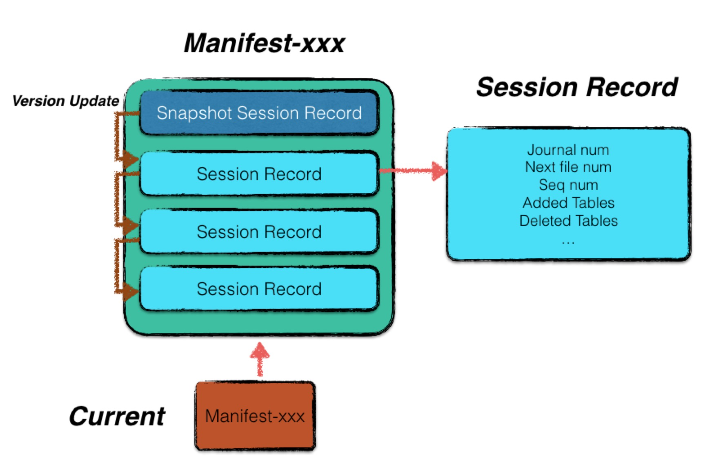
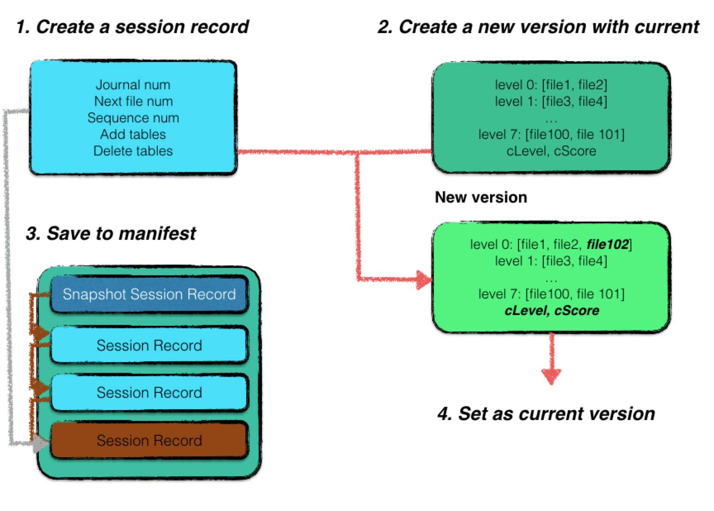
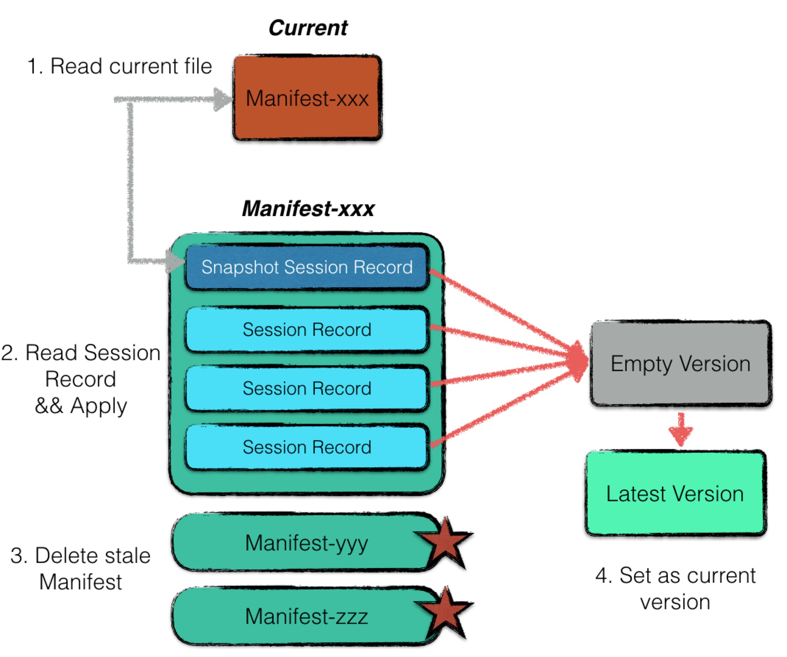

# LevelDB-Multi-version导读

## MVCC引言

在介绍LevelDB中“Version”的设计前，我们先来了解LevelDB中的MVCC。

MVCC是存储系统中常用来优化“读读并发”与“读写并发”并行的设计，LevelDB也不例外。LevelDB的MVCC机制不但使其能够并行化“读读并发”与“读写并发”操作，还使其能够实现快照读（Snapshot Read）。LevelDB的用户可以通过其提供的接口要求其保留一定时间之前的快照，在用户释放快照前，该快照创建时LevelDB中存在的数据就不会被释放。

《An Empirical Evaluation of In-Memory Multi-Version Concurrency Control》一文介绍了MVCC在内存中的实现([《An Empirical Evaluation of In-Memory Multi-Version Concurrency Control》论文翻译](http://blog.mrcroxx.com/posts/paper-reading/wu-vldb2017/#41-仅追加存储append-only-storage))。这篇综述剖析的MVCC实现中的层次与每个层次的常见方案。这里我们主要关注LevelDB的MVCC实现中的“版本存储”的设计。

想要实现MVCC，存储系统就要存储数据的多个版本。笔者将LevelDB的多版本存储设计分为了三个层次：

**从key/value的角度：** 每次变更操作的记录（Batch Writer可视为一次操作）都有不同且递增的SequenceNumber。对于一个UserKey，当存在SequenceNumber更高的的记录时，旧的记录不会被立即删除，至少要在该SequenceNumber之前的所有Snapshot都被释放后才能删除（具体删除时间与Compaction时间有关）。这是LevelDB实现Snapshot Read的基础。

**从MemTable的角度：** LevelDB中的MemTable通过引用计数来控制释放时间。在需要读取MemTable时（无论是Get操作还是Minor Compaction时），读取前会增大其引用计数，读取后减小引用计数。这样，即使MemTable已被通过Minor Compaction操作写入到Level-0文件，MemTable在被读取，它就不会被释放。

**从数据库文件的角度：** LevelDB的文件同样需要引用计数，当执行Major Compaction时，LevelDB不会立即删除已被合并的数据库文件，因为此时可能还有未完成的读取该文件的操作。

key/value的版本实际上也是依赖于内存与稳定存储，其分别在Compaction与Put/Get操作中体现，因此这里我们主要关注后两者。MemTable的多版本与Snapshot信息是不需要直接持久化的，因为数据库关闭时无法进行Snapshot Read，也就没有了Snapshot的概念，而最新的MemTable会通过WAL重建，旧的MemTable也不再会被依赖。而数据库文件则不同，LevelDB必须记录数据库文件的版本信息，否则在数据库重启时无法快速确定哪些文件是有效的（LevelDB提供了文件版本信息损坏时的修复机制）。而LevelDB中Version及相关概念就是为此设计的。

本文主要围绕LevelDB中Version、VersionEdit、VersionSet的设计与实现介绍与分析。考虑到Compaction和Version的关系较为密切，因此这里会结合一些Compaction的内容一起来说明。

## LevelDB-Multi-Version原理

Leveldb每次新生成sstable文件，或者删除sstable文件，都会从一个版本升级成另外一个版本。换句话说，每次sstable文件的更替对于leveldb来说是一个最小的操作单元，具有原子性。版本控制对于leveldb来说至关重要，是保障数据正确性的重要机制。

每当LevelDB触发了一次Compaction操作后，会在Leveli+1层生成一系列新的SSTable文件，作为输入的Level i层和Leveli+1层的原始SSTable文件在没有用户继续使用的情况下均可直接删除。LevelDB使用`Version`结构体来管理每个层级拥有的文件信息，每次compaction操作后会生成一个新的版本。Version结构体存储了当前层级的最新版本。

在生成新版本的过程中，LevelDB使用一个中间状态的`VersionEdit`结构来临时保存信息，最后将当前版本的信息-Version存储了当前的最新版本信息，与中间状态的VersionEdit进行合并处理后，会生成最新的版本，并使用该版本。

一系列版本构成一个版本集合，LevelDB中的`VersionSet`结构体负责存储版本集合，本身是一个双向链表结构。

因此，Version、VersionEdit、VersionSet三种结构体相互协同作用，使得LevelDB的多版本控制机制运转。此外，LevelDB中的快照功能就是通过序列号与多版本机制给用户提供一个特定版本的一致性视图。序列号就是每个kv对的SequenceNumer，每次写入都会递增该序列号，确保了可以精确的读到正确的版本。而每当对一个版本进行读取的时候，会将该版本数据的引用次数+1，从而保证这个版本在使用期间不会被销毁。

在LevelDB中，与Version相关的类有三个，分别是：`VersionEdit`、`Version`与`VersionSet`，而相关文件主要有`Manifest`和`Current`。LevelDB中Version相关信息记录的是LevelDB生成的文件的版本信息与相关元数据。LevelDB的版本信息是增量存储的，其存储方式与WAL相同，将版本的增量变化信息作为Record顺序写入Manifest文件中。下面分别介绍这几种结构体。

> 因此在写入manifest文件时用了与写入log record相同的接口，这里对应上了。

# LevelDB-Verison机制代码阅读

## VersionEdit机制

VersionEdit是一个版本的中间状态，用于保存一次Compaction操作后相当于当前版本产生的增量信息，如删除了哪些文件，以及相关的一些元数据；将VersionEdit信息应用到当前的版本Version上后，就可以生成最新的版本信息。代码位于version_edit.h和version_edit.cc文件中。

因为VersionEdit是增量数据，因此并非每个VersionEdit中都有所有类型的数据，因此序列化VersionEdit的每种类型的数据前会将该类型对应的Tag以Varint32的编码方式写入到其数据之前。这样在序列化VersionEdit的数据时，可以有选择的序列化需要的字段，而不必每次都序列化所有的数据字段。

## Version机制-compaction策略

Version表示当前的一个版本，该结构体会保存在当前版本中每个层级拥有的文件信息，以及指向前一个Version和后一个Version的指针等等。Version类的代码位于version_set.h和version_set.cc中。因此这里已经可以知道，VerisonSet中的Verison是通过双向链表的形式连接的。

LevelDB有两种触发compaction的策略：`size_compaction`(因为一个层级中文件个数或者大小超出限制导致的Compaction操作)和`seek_compaction`(因为一个层级中的某个文件无效读取次数过多导致的compaction操作，这会将冷数据放到更高的层级，即冷数据下沉)。Version结构体中为这两种策略分别设置了支持的机制，二者协同作用，从而让compaction操作更加合理：

- `size_compaction`：在Version中存在compaction_score_和compaction_level\_，这两个变量专用于size compaction机制。
- `seek_compaction`：在Version中存在file_to_compact_和file_to_compact_level\_，这两个变量专用于seek_compaction\_机制。

### size_compaction

Level0根据文件数量来决定是否需要压缩，level1-6根据当前层的所有文件的总字节数是否大于当前层所允许的最大总字节数来决定是否需要压缩，每次有的Version产生后，需要调用VersionSet::Finalize函数，根据上面的原理，来获取新版本中当前最需要进行压缩的Level，之后将最终需要压缩的SSTable的信息存储到compaction_score_和compaction_level\_中。具体请看源码。

### seek_compaction

根据SSTable文件的seek miss数量都否达到对应的文件元数据FileMetaData中的allow_seeks_值来决定是否触发对该SSTable文件的compaction操作。假设Level n层包含一个名为f1的文件，该文件的key范围为[L1,H1]，Level n+1层包含一个名为f2的文件，该文件的key范围为[L2,H2], 且[L1,H1]是[L2,H2]的子集。当我们需要查找键key1时，假设该key1既在f1中，也在f2中，因此我们会先查找Level n层的f1文件，如果查找失败，我们会继续查找Level n+1层的f2文件。此时f1层的读取就是一个无效查找，因为我们在f1中查找了key1，但是没有找到。当f1层的无效查找次数达到一个阈值时，说明f1层的数据已经过时，需要进行compaction操作。我们会把Version中的file_to_compact\_设置为f1，将file_to_compact_level\_设置为n，等待后续的compaction操作。

每个文件的allow_seeks_初始值的计算请见VersionSet::Builder::Apply()：该函数将VersionEdit信息应用于当前的版本，从而产生新版本文件，因此需要为新文件初始化相关元数据。

### 总结

LevelDB优先处理size_compaction，其次是seek compaction操作。每个Version中都会有相关的变量记录当前版本是否需要进行compaction操作。

## VersionSet机制

VersionSet负责将所有versions以双向链表的方式管理起来，每个Version中都保存了其对应版本中每一层Level中的SSTable文件的状态。current_指向了当前的最新版本，每当有compaction操作时，会产生一个VersionEdit对象，当前版本应用了VersionEdit对象后，就会产生新的版本。每个版本都有一个引用计数，代表是否有操作正在使用该版本，当某个版本的引用计数为0时，就可以将该版本从versionSet中移除。

每次进行完Compaction操作后，都会调用VersionSet::LogAndApply方法，将Compaction操作产生的VersionEdit对象应用到当前的版本上，产生最新的版本。具体源码位于version_set.h和version_set.cc中，读完源码就能较为细致的了解这些了。

此外，Versionset中的Recover方法会根据Manifest文件中记录的每次版本变化（通过VersionEdit的DecodeFrom方法）逐次回放生成一个最新的版本，适用于崩溃恢复或者LevelDB重启的时候。

### VersionSet::LogAndApply()

大概流程如下，其中涉及到了Manifest文件，该文件与版本控制息息相关，后面会详细介绍：

1. 将VersionEdit通过Builder辅助类，应用到Versionset的current_版本上，会生成一个新的版本。
2. 将版本变化写入到Manifest文件中，之后执行Finalize方法，检查最新版本中是否需要进行size compaction。
3. 将新版本挂载到versionset双向链表中，将current版本更新为当前的最新版本。

# LevelDB-版本控制之Manifest机制

LevelDB通过version以及versionset来管理元信息。Manifest文件就是用来保存元信息的磁盘文件，LevelDB启动时会先到数据目录寻找一个名为CURRENT的文件，该文件中会保存Manifest的文件名称，通过读取Manifest文件内容即可重建元信息。<u>所以要清楚地是，CURRENT文件中保存了指向MANIFEST文件的指针。</u>

Manifest保存元信息的方法与Log Record的格式相同，同样是以block为基本单位，每个块为32KB(32768B)。元信息的内容为VersionEdit结构编码之后生成的字符串(见VerisonEdit的EncodeTo方法)。每个新版本都是由current_版本应用了由于Compaction操作产生的新的VerisonEdit对象合并之后生成的，因此从Manifest文件中读取元信息内容后首先要解码为一个个VersionEdit结构，然后对初始版本依次应用VersionEdit对象即可恢复处崩溃前的最新的完整的版本出来。

> 注意这里的block与SSTable文件中的以Block为单位组成的Block不一样，SST中的Block默认大小为4KB，而这里的Log文件和Manifest文件的Block为32KB。

在读完了version_set.h和version_set.cc中的代码之后，这部分理解起来应该是水到渠成的。

## 版本控制

已知LevelDB每次Compaction操作会涉及到不同Level的文件变动，这会让当前的DB从一个版本升级成另外一个版本。之前我们已经了解到每次Compaction操作带来的变更会被保存到VersionEdit中，之后当前的Version通过Builder，将VersionEdit应用到当前版本上，之后通过合并当前版本与应用了VersionEdit的版本从而生成一个最新版本，为了让这个过程不会因为系统崩溃而丢失，LevelDB同样将每次compaction操作产生的VersionEdit信息以log record的形式存储到manifest文件中，而CURRENT文件中存储的是MANIFEST文件名称，即文件指针。

## MANIFEST文件说明

manifest文件专用于记录版本信息。leveldb采用了增量式的存储方式，记录每一个版本相较于上一个版本的变化情况。每条Log Record的Content字段保存了那一次Compaction操作产生的VersionEdit信息的序列化内容。

> 变化情况大致包括：
>
> - 新增了哪些sstable文件；
> - 删除了哪些sstable文件（由于compaction导致）；
> - 最新的journal日志文件标号等
>
> 具体内容直接看VersionEdit结构体源码即可。

借助这个Manifest文件，leveldb启动时，可以根据一个初始的版本状态，依次应用每一条Log Record，从而重建出崩溃之前的版本，因此使得系统的版本信息恢复到最近一次使用的状态。

一个Manifest文件的格式示意图如下所示：



一个Manifest内部包含若干条Session Record，**其中第一条Session Record**记载了当时leveldb的*全量版本信息*，其余若干条Session Record仅记录每次更迭的变化情况。

> 上面说的Sesssion Record的内部结构与WAL的Log record的构成完全相同：包含CRC校验码(4B)、Content Length(2B)、Type(1B)、Content本身。区别在于WAL的Content字段里面保存的是若干个写入操作，而MANIFEST中的Content字段中保存的是VersionEdit序列化后的字符串信息。

因此，每个manifest文件的第一条Session Record都是一个记录点，记载了全量的版本信息，可以作为一个初始的状态进行版本恢复。

一个Session Record可能包含以下字段：

- Comparer的名称；
- 最新的journal文件编号；
- 下一个可以使用的文件编号；
- 数据库已经持久化数据项中最大的sequence number；
- 新增的文件信息；
- 删除的文件信息；
- compaction记录信息；

## Commit

每当（1）完成一次major compaction整理内部数据或者（2）通过minor compaction或者重启阶段的日志重放新生成一个0层文件，都会触发leveldb进行一个版本升级。

一次版本升级的过程如下，具体流程要看LogAndApply函数，这里是大概流程：



需要注意的是，minor compaction和major compaction触发版本升级时，二者生成的versionEdit信息是有所不同的，minor compaction的信息会多一些：

1. 新建一个session record，记录状态变更信息；
2. 若本次版本更新的原因是由于minor compaction或者日志replay导致新生成了一个sstable文件，则在session record中记录新增的文件信息、最新的journal编号、数据库sequence number以及下一个可用的文件编号；
3. 若本次版本更新的原因是由于major compaction，则在session record中记录新增、删除的文件信息、下一个可用的文件编号即可；
4. 利用当前的版本信息，加上session record的信息，创建一个全新的版本信息。相较于旧的版本信息，新的版本信息更改的内容为：（1）每一层的文件信息；（2）每一层的计分信息；
5. 将session record持久化；
6. 若这是数据库启动后的第一条session record，则新建一个manifest文件，并将完整的版本信息全部记录进session record作为该manifest的基础状态写入，同时更改current文件，将其**指向**新建的manifest；
7. 若数据库中已经创建了manifest文件，则将该条session record进行序列化后直接作为一条记录写入即可；
8. 将当前的version设置为刚创建的version；

> 注意，对于leveldb来说，增减某些sstable文件需要作为一个原子性操作，状态变更前后需要保持数据库的一致性。
>
> 在整个过程中，原子性体现在：整个操作的完成标志为manifest文件中完整的写入了一条session record，在此之前，即便某些文件写入失败导致进程退出，数据库重启启动时，仍然能够恢复到崩溃之前正确的状态，而将这些无用的sstable文件删除，重新进行compaction动作。
>
> 一致性体现在：leveldb状态变更的操作都是以version更新为标记，而version更新是整个流程的最后一步，因此数据库必然都是从一个一致性的状态变更到另外一个一致性的状态。

## Recover

数据库每次启动时，都会有一个recover的过程，简要地来说，就是利用Manifest信息重新构建一个最新的version。本质上是逐条应用MANIFEST中的日志信息，从而重建出崩溃之前的状态：



过程如下：

1. 利用Current文件读取最近使用的manifest文件；
2. 创建一个空的version，并利用manifest文件中的session record依次作apply操作，还原出一个最新的version，注意manifest的第一条session record是一个version的快照，后续的session record记录的都是增量的变化；
3. 将非current文件指向的其他**过期**的manifest文件删除；注意CURRENT文件只会保存当前最新的MANIFEST文件。
4. 将新建的version作为当前数据库的version；

注意，随着leveldb运行时间的增长，一个manifest中包含的session record会越来越多，故leveldb在每次启动时都会重新创建一个manifest文件，并将第一条session record中记录当前version的快照状态。

其他过期的manifest文件会在下次启动的recover流程中进行删除。

leveldb通过这种方式，来控制manifest文件的大小，但是数据库本身没有重启，manifest还是会一直增长。

## CURRENT文件

由于每次启动，都会新建一个Manifest文件，因此leveldb当中可能会存在多个manifest文件。因此需要一个额外的current文件来指示当前系统使用的到底是哪个manifest文件。

该文件中只有一个内容，即当前使用的manifest文件的文件名。

## 异常处理

倘若数据库中的manifest文件丢失，leveldb是否能够进行修复呢？答案是肯定的。

当leveldb的manifest文件丢失时，所有版本信息也就丢失了，但是本身的数据文件还在。因此leveldb提供了`Repairer`接口供用户进行版本信息恢复，具体恢复的过程如下：

1. 按照文件编号的顺序扫描所有的sstable文件，获取每个文件的元数据（最大最小key），以及最终数据库的元数据（sequence number等）；
2. 将所有sstable文件视为0层文件（由于0层文件允许出现key重叠的情况，因此不影响正确性）；
3. 创建一个新的manifest文件，将扫描得到的数据库元数据进行记录；

但是该方法的效率十分低下，首先需要对整个数据库的文件进行扫描，其次0层的文件必然将远远大于4个，这将导致极多的compaction发生。

## 多版本并发控制

leveldb中采用了MVCC来避免读写冲突。

试想一下，当某个迭代器正在迭代某个sstable文件的内容，而后台的major compaction进程完成了合并动作，试图删除该sstable文件。那么假设没有任何控制并发的机制，就会导致迭代器读到的内容发生了丢失。

最简单的处理方式就是加锁，当发生读的时候，后台所有的写操作都进行阻塞，但是这就机制就会导致leveldb的效率极低。故leveldb采用了多版本并发控制的方法来解决读写冲突。具体体现在：

1. sstable文件是只读的，每次compaction都只是对若干个sstable文件进行多路合并后创建新的文件，故不会影响在某个sstable文件读操作的正确性；
2. sstable都是具有版本信息的，即每次compaction完成后，都会生成新版本的sstable，因此可以保障读写操作都可以针对于相应的版本文件进行，解决了读写冲突；
3. compaction生成的文件只有等合并完成后才会写入数据库元数据，在此期间对读操作来说是透明的，不会污染正常的读操作；
4. 采用引用计数来控制删除行为。当compaction完成后试图去删除某个sstable文件，会根据该文件的引用计数作适当的删除延迟，即引用计数不为0时，需要等待至该文件的计数为0才真正进行删除；

# LevelDB-Compaction操作流程

在进行compaction操作时，为了不影响LevelDB中kv对的写入，会使用一个单独的线程执行Compaction，执行过程如下：首先选定本次compaction操作需要参与的文件，然后使用归并排序将所有参与文件中的数据排序后输出到新的文件之中，最后将本次的变更情况生成VersionEdit文件，将其序列化为Log Record存入到MANIFEST文件中，最后通过builder将versionedit应用于当前版本，生成最新的版本，代表compaction操作后各层文件情况。

LevelDB中Compaction具有优先级，其顺序为：Minor Compaction > Manual Compaction > Size Compaction > Seek Compaction。无论是Minor Compaction还是Major Compaction，在设置了相应的参数后，都会通过`DBImpl::MaybeScheduleCompaction`方法来判断是否需要执行Compaction。

读这部分之前，确保已经完成了version、versionedit、versionSet、Compaction部分的源码阅读。

## 触发时机

`size compaction`：当内存中的memtable写入超出限制后，则会将当前memtable转化为immutable memtable，通过minor compaction生成一个SSTable，并将其写入到Level 0之中，此时Level0的文件数量若超过限制，则会触发size compaction策略。

`seek compaction`：当某文件的无效读取次数达到阈值时，触发这种压缩策略。

LevelDB的compaction操作实际上是一个递归调用过程，每次对Level n层的compaction操作都会相应改变Level n+1层的文件大小，从而可能再次触发下一层的compaction操作。

BackGroundCompaction函数是执行Compaction操作的入口。所有的逻辑都从这个函数开始，因此要详细了解Compaction操作的流程，从该函数开始去逐步的深入源码，是非常合适的。

## 文件选取

每次compaction操作之前，若是非手动指定的，需要首先决定参与compaction的层级，之后选取需要参与的文件，最后对选中的文件使用归并排序生成一个新文件。决定层级level、level+1以及选取level中参与文件的方法为VersionSet中的pickCompaction方法，PickCompaction方法返回的是一个Comapction实例，该实例中包含了本次compaction操作的相关信息。

size compaction的优先级要高于seek compaction，我们更喜欢由于某个level中的数据过多而触发的compaction操作，这是compaction在设计时的理念之一。

每一层中，要参与压缩的文件，以compact_pointer_为基础信息获取到的文件为准，与该文件的key范围重合的要参与；下一步，在上述文件集合基础上，在当前层中，是该集合文件的边界文件的文件也要参与。每次compaction操作时，level和level+1层的参与compaction的文件就是这么确定的。

> 边界文件：从compaction_files中提取最大的文件b1，然后在level_files中搜索一个文件b2，其中user_key(u1) = user_key(l2)，即b1文件的最大key的user_key等于b2文件的最小key的user_key。如果找到这样的文件b2(称为边界文件)，则将其添加到compaction_files中，然后使用这个新的上界再次搜索。
>
> 如果有两个块，b1=(l1, u1)和b2=(l2, u2)，并且user_key(u1) = user_key(l2)，如果我们压缩b1但不压缩b2，那么后续的get操作将产生错误的结果，因为它将从level i中的b2而不是b1中返回记录，因为它会逐级搜索与提供的user key匹配的记录。这样会丢失一部分更改，导致数据不完整。
>
> 简单来说，边界文件的最小key一般大于当前文件集合的最大key，但是两者的user_key部分一定是相等的。

### optimization：尝试进一步扩大Level层参与压缩文件数量

当我们初步的获取到了level层和level+1层要参与本次compaction操作的文件集合后，可以根据这两个文件集合的key范围，进一步的尝试扩大level层参与压缩的文件集合。

 判断我们是否可以增加level层的输入文件数量，而不改变我们选择的level+1层文件的数量。 在上面，我们获取了level层和level+1层的所有文件的key范围，现在根据该key范围，我们尝试是否可以进一步的扩展level层的输入文件数量，而不改变level+1层的文件数量。

如果扩展后的Level 层文件集合导致Level +1层文件集合的数量增加，就不能应用这次扩展，**因为本次扩展后的comapction操作会导致level +1层出现key重叠的文件**。这是因为在LevelDB中，不同层级的文件之间的键范围可以重叠，但同一层级的文件之间不能有重叠（只有level0会出现同一层的文件key重叠）。

> TODO：这里还是有些疑问，不知道为什么会导致level +1层会出现key重叠的文件。

具体见VersionSet::SetupOtherInputs方法中的逻辑。

## 执行流程（难，有问题）

BackGroundCompaction函数中有对所有类型Compaction操作的调度逻辑，是整体流程，着重阅读了需要进行文件合并拆分的compaction操作流程，核心函数是DoCompactionWork。

Compaction操作的执行流程具体在DBImpl::DoCompactionWork函数中实现，结合源码理解。 首先要知道每个DBImpl实例中都会有自己的快照列表，本质上每个快照对象都封装了一个sequencenumber时间戳，每次compaction操作开始前都需要指定一个最小快照对象，小于等于最小快照中的时间戳的kv操作都不会被计入到compaction操作的输出文件中去。

难点在于DoCompaction中的一段逻辑，我对这里的一个特殊情况不是特别了解，可能需要后面从全局上理顺逻辑后，这里就会理解了，先挖个坑：

```c++
// 若不是第一次见关于该user key的kv对，则比较最近见到的kv对(不包括当前kv对)的操作序列号)与
      // 本次compaction操作的最小快照，若小于等于最小快照，则当前kv对不需要写入到输出文件中
      // 考虑对key1的操作，smallest=100,第一次操作是操作为100的insert，根据代码逻辑，操作是一定会成功的。
      // 第二次操作为101，无论类型是什么，因为第一次操作为100, 根据下述逻辑，第二次操作会被drop掉。
      // 若还有第三次操作103，那么第三次操作会成功，因为第二次操作的seq大于smallest。
      // 这不会影响到最终查询结果，因为我们永远不会服务一个小于smallest的快照，因此100的insert是无效的，所以我们看不到这个数据。
      // 若第二次是delete，虽然他会被drop掉，但是结果是一样的。若第二次是insert，那么会暂时有不一致性，但是这个不一致性是中间状态。
      // 第三次一定会成功，所以从第三次开始，数据就会即时进入builder中。当次数大于3时，数据没问题，但是次数为2时，数据会被drop掉。
      // 问题在于，若只有两次操作，第一次是insert，第二次还是insert，那么第二次会被drop掉，这是不是就意味着数据丢失了呢？
      // FIXME:当某个user_key只有两次操作，且第一次操作等于smallest，第二次操作为insert时，第二次操作会被drop掉，这样会导致数据丢失。
      if (last_sequence_for_key <= compact->smallest_snapshot) {
        // Hidden by an newer entry for same user key
        // 之前遍历到了一个版本号小于当前版本号的kv对，丢弃，之后会有一个更新的kv对覆盖它
        drop = true;  // (A)
      } else if (ikey.type == kTypeDeletion &&
                 ikey.sequence <= compact->smallest_snapshot &&
                 compact->compaction->IsBaseLevelForKey(ikey.user_key)) {
        // 若当前kv对是一个删除操作，且其操作序列号小于等于compact->smallest_snapshot，
        // 且该kv对的user key的最早版本在level+1层中,即更高层不会再有关于该键的操作出现，
        // 那么该kv对不需要写入到输出文件中。
        // For this user key:
        // (1) there is no data in higher levels
        // (2) data in lower levels will have larger sequence numbers
        // (3) data in layers that are being compacted here and have
        //     smaller sequence numbers will be dropped in the next
        //     few iterations of this loop (by rule (A) above).
        // Therefore this deletion marker is obsolete and can be dropped.
        // 对于该user_key而言:
        // (1) 除了当前level，在更高的level中没有该user_key的数据
        // (2) 在更低的level中有更大的操作序列号
        // (3) 根据规则(A)可知，在这里被compaction的level中，有更小操作序列号的数据将在接下来的几次迭代中被删除。
        // 因此，这个删除标记是过时的，可以被删除。
        drop = true;
      }

```

## 文件清理

在compaction操作完成后，会产生一些新的输出文件，同时也会有一些文件可以被删除，具体请见RemoveObsoleteFiles()函数，涉及到了WAL日志文件，MANIFEST文件,SSTable文件等等。
